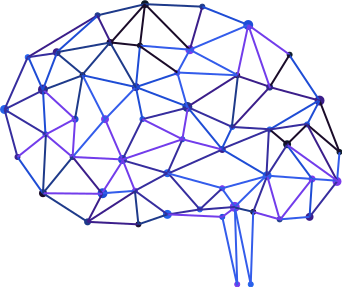

<div align="center">
  
  <br>
  <!-- <em>Synthetic Default Mode Network Framework</em> -->
</div>

# Synthetic Default Mode Network (SDMN) Framework

A cutting-edge research framework for simulating synthetic default mode networks using artificial spiking neural networks inspired by biological neurons.

## Vision

This framework aims to create sophisticated artificial neural networks that can emulate and eventually supersede the complexity, diversity, and connectivity of human neural networks. The core focus is on modeling default mode networks with feedback loops that generate synthetic neural network waves similar to brain waves recorded via EEG.

## Key Features

- **Spiking Neural Network Simulation**: Biologically-inspired artificial spiking neurons
- **Modular Design**: Standardized interfaces for interchangeable neuron models
- **Simulation Engine**: High-performance core engine for neural network simulation
- **Probe System**: Real-time monitoring and data collection at any network point
- **Network Assembly Tools**: GUI and programmatic tools for building complex networks
- **Visualization Suite**: Comprehensive tools for network analysis and behavior visualization
- **Feedback Loop Analysis**: Study emergent patterns and higher-order network modes

## Project Structure

```
├── docs/                   # Comprehensive documentation
│   ├── plan/              # Project planning and architecture docs
│   ├── api/               # API documentation
│   └── examples/          # Usage examples
├── src/                   # Source code
│   ├── core/              # Core simulation engine
│   ├── neurons/           # Neuron model implementations
│   ├── networks/          # Network assembly and management
│   ├── probes/            # Monitoring and data collection
│   └── visualization/     # Visualization tools
├── scripts/               # Utility scripts and tools
├── tests/                 # Test suite
├── examples/              # Example networks and simulations
└── docker/                # Containerization files
```

## Quick Start

See [docs/quickstart.md](docs/quickstart.md) for detailed getting started instructions.

## Development Status

This project is in early development phase, focusing on:
1. Core simulation engine implementation
2. Basic spiking neuron models
3. Fundamental network assembly tools
4. Probe system architecture

## Technology Stack

- **Current**: Python 3.11+
- **Future**: CUDA/C++ for high-performance computing
- **Containerization**: Docker/Podman with Linux LTS base
- **Visualization**: matplotlib, plotly, networkx
- **GUI**: tkinter/PyQt for network assembly interface

## Research Goals

This framework supports groundbreaking research into:
- Synthetic neural network oscillations and wave patterns
- Default mode network simulation and analysis based on [neuroscience research](https://en.wikipedia.org/wiki/Default_mode_network)
- Emergent behavior in complex spiking neural networks
- **Basic artificial self-awareness and self-preservation behaviors**
- **Risk-reward assessment and adaptive decision-making in neural networks**
- Bio-inspired artificial intelligence architectures with consciousness indicators

## License

This work is licensed under a [Creative Commons Attribution-NonCommercial 4.0 International License](https://creativecommons.org/licenses/by-nc/4.0/).

[](https://creativecommons.org/licenses/by-nc/4.0/)

**You are free to:**
- **Share** — copy and redistribute the material in any medium or format
- **Adapt** — remix, transform, and build upon the material

**Under the following terms:**
- **Attribution** — You must give appropriate credit, provide a link to the license, and indicate if changes were made
- **NonCommercial** — You may not use the material for commercial purposes

This license ensures the project remains open for research and educational use while requiring proper citation and preventing commercial exploitation.

## Contributing

This is a research project. Contribution guidelines will be established as the project matures.

---

*"Advancing our understanding of neural networks through synthetic biology-inspired simulation."*
