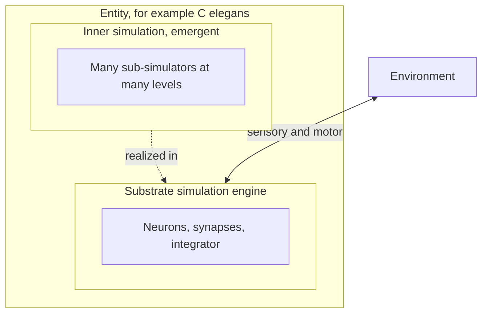
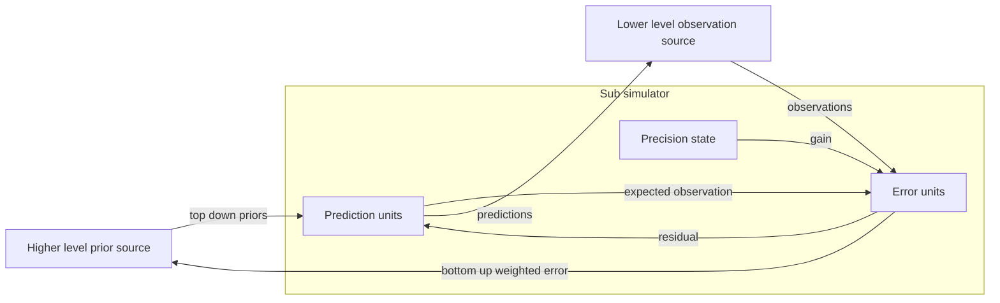
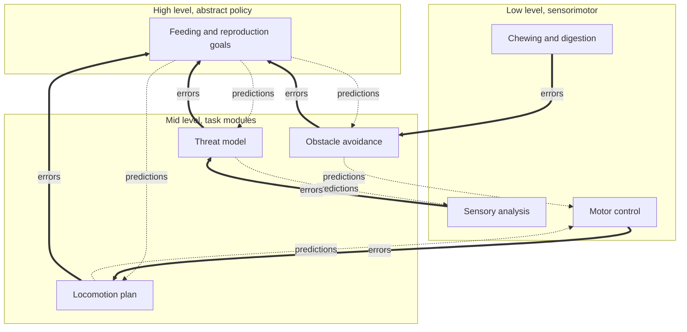
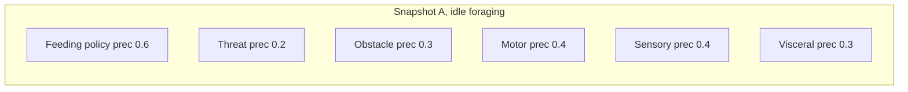

# Inner Simulation Architecture

Status: design document. No code commitments in this increment.
Depends on: [docs/TWO_SIMULATIONS.md](../TWO_SIMULATIONS.md), [docs/plan/IDEAS.md](IDEAS.md).
Companions: [docs/plan/world_simulation.md](world_simulation.md) (dynamics, priors, drives, priority field, and the C. elegans implementation path); [docs/plan/neuron_units.md](neuron_units.md) (the functional basis and complexity spectrum of the substrate's atomic processing units).
Supersedes the formal-architecture portion (not the research/ethics portion) of [docs/plan/self_awareness_architecture.md](self_awareness_architecture.md).

---

## 1. Purpose and scope

This document defines the **inner simulation** — the ongoing, emergent predictive process that a running entity performs on top of its substrate — as a first-class concept in this project.

It commits to:

- The conceptual foundation (predictive coding / active inference) from which the inner simulation is derived.
- The anatomy of a **sub-simulator** as the atomic unit.
- The two axes the sub-simulators are organized along: **levels of abstraction** (vertical) and **functional modules** (horizontal).
- The three signal types — **predictions**, **errors**, **precision** — and how they flow.
- The interpretation of **focus** as precision reallocation.
- The relation to the existing SDMN codebase and to the C. elegans entity.
- The observable signatures we will use to tell whether an inner simulation is actually running.

It does not commit to:

- Concrete data structures, module layout on disk, or Python APIs.
- A specific learning rule.
- Which existing source files change, and how.
- Performance targets.

Those are deferred to a subsequent code-design increment.

For the short, top-level statement of how this relates to the rest of the project, read [docs/TWO_SIMULATIONS.md](../TWO_SIMULATIONS.md) first.

---

## 2. The two simulations

The project hosts two simulation concepts that must not be conflated.

### 2.1 Substrate simulation engine

The numerical integrator that advances the equations of motion of a nervous system. In this codebase it is realized by [src/sdmn/core/simulation_engine.py](../../src/sdmn/core/simulation_engine.py), [src/sdmn/core/time_manager.py](../../src/sdmn/core/time_manager.py), [src/sdmn/core/event_system.py](../../src/sdmn/core/event_system.py), and [src/sdmn/core/state_manager.py](../../src/sdmn/core/state_manager.py), together with the neuron and synapse models in [src/sdmn/neurons/](../../src/sdmn/neurons/) and [src/sdmn/synapses/](../../src/sdmn/synapses/). Its vocabulary is millivolts, picoamps, milliseconds, gating variables.

### 2.2 Inner simulation

The ongoing predictive process the substrate gives rise to when it is running. It is not integrated by hand; it is what the network is *doing* on top of the physics. Its vocabulary is expectations, prediction errors, precision, policies, beliefs. It is distributed across many sub-simulators — none of which is the "main" one — operating at many levels of abstraction.

### 2.3 Responsibilities and non-overlaps

| | Substrate simulation engine | Inner simulation |
|---|---|---|
| Kind of thing | A numerical integrator | An emergent predictive process |
| Operates on | Voltages, spikes, synaptic conductances, ion channels | Expectations, prediction errors, precision, policies |
| Native timescale | The integration time step dt | Any; includes longer-than-behavior timescales |
| Where it lives | [src/sdmn/core/](../../src/sdmn/core/) | Inside the substrate's neurons and their connectivity, not beside them |
| Stopping it causes | The entity to freeze | The entity to stop predicting the world while remaining physically present |
| Owned by | The framework authors | The entity itself, as emergent behavior |

### 2.4 Coupling

The inner simulation is not a parallel process. It is realized *inside* the same neurons, synapses, and activity patterns the substrate integrates. The substrate engine does not know what predictions are; it just advances state. The inner simulation does not know what time steps are; it operates in the natural vocabulary of activity.

Two consequences follow.

1. **Observability.** You cannot read the inner simulation from the substrate's state variables alone. It lives in *relations* between activity patterns — the difference between what the network expected a population to be doing and what it is actually doing — not in the raw voltages of either.
2. **Where to intervene.** To improve the inner simulation, you change what the network computes: its connectivity, its learned weights, its neuromodulatory state. Changing the integrator does not change the inner simulation, only how fast and accurately the substrate advances it.

### 2.5 The layered picture

Read this bottom-up. The substrate integrates the entity's neurons and synapses. On top of that substrate — in the same neurons, not next to them — many sub-simulators collectively constitute the inner simulation. The entity interacts with the world through the substrate (sensory input arrives as current injection; motor output comes from motor-neuron activity), but what the entity *means* by that interaction is decided by the inner simulation.

---

## 3. Conceptual foundation

The user-level intuition behind the inner simulation — "the network always maintains an active internal simulation of the world; when reality disagrees with what it predicted, the mismatch propagates through many layers and updates the model" — is the core claim of **predictive coding** and, in its generalized form, of Karl Friston's **free-energy principle / active inference**. This project does not re-derive that theory. It adopts it.

### 3.1 Canonical references

- Rao, R.P.N. and Ballard, D.H. (1999). *Predictive coding in the visual cortex: a functional interpretation of some extra-classical receptive-field effects.* Nature Neuroscience, 2(1), 79-87.
- Friston, K. (2010). *The free-energy principle: a unified brain theory?* Nature Reviews Neuroscience, 11(2), 127-138.
- Bastos, A.M., Usrey, W.M., Adams, R.A., Mangun, G.R., Fries, P., and Friston, K.J. (2012). *Canonical microcircuits for predictive coding.* Neuron, 76(4), 695-711.
- Feldman, H. and Friston, K.J. (2010). *Attention, uncertainty, and free-energy.* Frontiers in Human Neuroscience, 4:215.
- Heeger, D.J. (2017). *Theory of cortical function.* PNAS, 114(8), 1773-1782.

These are already catalogued in [docs/plan/IDEAS.md](IDEAS.md) under "Intrinsic Simulation / World Model & Predictive Coding" and "Context Switching, Zoom, and Granularity Control". That section of IDEAS.md is the informal antecedent of this document.

### 3.2 What this project takes from the literature

1. **Hierarchical generative model** (Rao and Ballard). Each level has **prediction units** that send expectations downward and **error units** that send residuals upward. Errors exist at every level, not only at the sensory boundary.
2. **Active inference** (Friston). The inner simulation is not passive. Sub-simulators can reduce prediction error by changing the world (acting) as well as by changing the model (updating). Motor output is one special case of "making the world match the prediction".
3. **Precision weighting as attention** (Feldman and Friston). Each error signal has a precision — an inverse variance, a confidence. The allocation of precision across the network is the mechanism of attention and of focus shifts.
4. **Canonical microcircuits** (Bastos et al.). Prediction and error signals use anatomically distinct pathways and distinct frequency bands. Feedforward prediction errors travel at gamma; top-down predictions at alpha and beta.

### 3.3 What this project may contribute back

Classical predictive coding assumes a feedforward hierarchy with feedback. The substrate in this project is explicitly **cyclic** — C. elegans-inspired, rich in recurrent and gap-junction connectivity. Two things follow.

1. Prediction errors do not merely flow "up"; they circulate. Abstraction may not be purely spatial (higher layers) but also temporal (slower dynamics correspond to more abstract representations), as hypothesized in [docs/plan/IDEAS.md](IDEAS.md) under "From Local Learning to Abstract Concepts".
2. A small recurrent network maintaining an always-on, partial, context-dependent world model — rather than a deep hierarchy settling passively into a percept — is closer to Friston's active inference than to Rao and Ballard. Implementing it explicitly in a cyclic substrate is a relatively unexplored region of the literature.

These are open research lines for the project. The architecture below is designed to permit them without forcing them.

---

## 4. Architecture of the inner simulation

The inner simulation is organized along two orthogonal axes: **levels of abstraction** (vertical) and **functional modules** (horizontal). A **sub-simulator** sits at the intersection of one level and one module. There is no central coordinator; coherence is an emergent property of the network of sub-simulators and their shared substrate.

### 4.1 The sub-simulator: atomic unit

A **sub-simulator** is the smallest unit of inner simulation. It is whatever slice of the network is responsible for maintaining an expectation about some specific set of variables and for noticing when that expectation is wrong. A sub-simulator has:

- A **generative model** — implicit, distributed across its prediction units and their connectivity, not an object you can point at. It encodes "given my current beliefs and inputs, what do I expect to be true about the variables I track?"
- **Prediction units** — population(s) of neurons whose activity represents the current expectation. They drive downstream receivers.
- **Error units** — population(s) of neurons whose activity represents the residual between current expectation and what is currently observed (either from lower levels or from sensors). They drive upstream receivers.
- **Precision state** — a scalar or vector gain that weights how strongly the error units signal. Modulated, not fixed. This is what "focus on this sub-simulator" means in mechanical terms.
- **An afferent and efferent protocol** — it receives priors from sub-simulators above or laterally, sends errors up or laterally, sends predictions down or laterally, receives observations from below or from sensors.

"Above" and "below" in cyclic circuits mean relative abstraction, not fixed anatomical positions.

A sub-simulator does not need to be a clean, named brain region. In the C. elegans connectome it will usually be a functional pattern spanning a handful of neurons that can sustain coordinated activity. In a richer artificial network it may correspond to a more cleanly delimited population. The **interface** — prediction out, error out, observation in, prior in, precision knob — is what defines a sub-simulator. The neurons backing the interface are secondary and swappable.

### 4.2 Levels of abstraction

The user required the inner simulation to operate "on many different levels of abstractions". A **level** is a relative position in the abstraction hierarchy, not a fixed absolute tier. Three levels are sufficient for a first description; more can be added without changing the architecture.

- **Concrete / sensorimotor level.** Tracks variables close to the body and to immediate sensation. Variables are fast — milliseconds to a few hundred milliseconds. Examples: predicted next-step muscle activation, predicted chemical gradient at the nose if the worm moves forward, predicted proprioceptive feedback after a motor command.
- **Task / situation level.** Tracks variables at the scale of a single behavior episode. Variables are medium-speed — hundreds of milliseconds to seconds. Examples: predicted trajectory to a food source, predicted outcome of an avoidance maneuver, predicted course of a pharyngeal pumping bout.
- **Policy / goal level.** Tracks variables at the scale of extended behavior and homeostasis. Variables are slow — seconds to the organism's lifetime. Examples: predicted nutritional state under continued foraging, predicted reproductive outcome under a given life-history choice, predicted safety under a given threat-management strategy.

Levels are **defined by the dynamical timescale of their prediction units**, not by anatomical distance from sensors. In the cyclic substrate this project uses, two sub-simulators at the same anatomical locus but with different membrane and synaptic time constants are at different levels. This is consistent with the hypothesis in [docs/plan/IDEAS.md](IDEAS.md) that in cyclic networks abstraction may be primarily temporal.

**Predictions flow down the hierarchy; errors flow up.** "Down" and "up" refer to abstraction, not anatomy. A policy-level sub-simulator pushes expectations onto a task-level sub-simulator; the task-level sub-simulator's uncorrected residual is its error, which it sends back up.

### 4.3 Functional modules

Orthogonal to level is the horizontal factorization into **functional modules**. Each module is responsible for tracking one aspect of the body and the world. Modules are not disjoint subsets of neurons — they overlap, share neurons, and interact through the shared substrate — but they have distinct predicted-variable families.

The user's examples map to an initial catalog:

- **Motor / locomotion module.** Predicts body configuration, muscle activations, proprioceptive feedback. Concrete level: next-step muscle state. Task level: gait, trajectory shape. Policy level: locomotion style matched to life phase (roaming vs. dwelling, for example).
- **High-policy module (feeding, reproduction).** Predicts resource-relevant and reproductive-relevant outcomes under alternative strategies. Runs predominantly at the policy level and pushes expectations onto lower-level modules. This is where long-horizon goals enter the inner simulation.
- **Obstacle avoidance module.** Predicts collision consequences, body-environment contact, safe paths. Concrete level: proprioceptive and mechanical predictions near the body surface. Task level: predicted collision-free paths.
- **Threat model module.** Predicts adversarial or dangerous developments in the environment. Strongly cross-modal; takes inputs from sensory modules and from memory-like slow dynamics. Policy level: disposition toward risk. The word "model" here is literal — this module maintains a running simulation of how threats might evolve.
- **Visceral module (chewing, digestion).** Predicts pharyngeal cycles, digestive state, gut feedback. Concrete level: rhythmic muscle activation and mechanosensory feedback. Task level: feeding-bout outcomes. This module is relatively autonomous (in C. elegans, it is almost a separate nervous system).
- **Sensory analysis module(s).** Predict the next state of a sensory stream. Several flavors — chemical, mechanical, thermal, and in richer entities visual. In the cortical analogue, this is where early sensory processing lives; in C. elegans it is the chemosensory and mechanosensory neurons with their immediate targets.

This catalog is **open-ended**. Any neural center responsible for a function can host a module. Modules do not pre-declare themselves; what matters is that they have coherent predicted-variable families and error-reporting interfaces. Modules can also nest: a sensory-analysis module may decompose into "edge tracking", "motion prediction", and "identity prediction" sub-modules, each a sub-simulator in its own right.

Dotted arrows are predictions going down the abstraction hierarchy; solid double arrows are prediction errors going up. Arrows are drawn sparsely for readability — in practice every sub-simulator has bidirectional traffic with every sub-simulator it shares neurons or projections with, and lateral arrows between modules on the same level exist but are not shown.

### 4.4 Prediction, error, and precision mechanics

Three signal types flow through the inner simulation.

**Predictions.** Top-down or lateral signals from one sub-simulator to another, carrying the first's current expectation about what the second should be doing or representing. In substrate terms, these are activity patterns on dedicated projections — modulatory, slow, alpha/beta-band in the canonical microcircuit picture.

**Errors.** Bottom-up or lateral signals carrying the residual between what a sub-simulator predicted and what it is actually receiving. In substrate terms, these are activity patterns on dedicated projections — gamma-band, sharper, driving updates in the receiver. Errors are always defined at every level of the hierarchy that has a non-trivial prediction, not only at the sensory boundary.

**Precision.** A gain term attached to each error signal, representing how much weight the receiving sub-simulator should give that error. A low-precision error is "yes, it was wrong, but I would not trust my measurement here". A high-precision error is "this is reliable, update on it". Precision is modulated globally and locally, on timescales both fast (attentional switches) and slow (neuromodulatory state).

#### Two loops, two timescales

The inner simulation runs two loops at different timescales.

1. **Inference loop (fast).** Given current weights and structure, update moment-to-moment the activity of prediction units and error units to best match incoming observations. This is the continuous operation of the inner simulation. Time constants comparable to neuronal membrane and synaptic time constants.
2. **Learning loop (slow).** Given accumulated prediction errors, update the weights that govern how prediction units project onto error units, and how sub-simulators project onto each other. This is how the generative model itself improves. Time constants of seconds to many minutes.

The concrete learning rule is a **non-goal** of this document. Candidates — STDP (already partly present in the codebase at [src/sdmn/visualization/fast_sim.py](../../src/sdmn/visualization/fast_sim.py)), predictive-coding credit assignment, equilibrium propagation, dendritic localized learning — are catalogued in [docs/plan/IDEAS.md](IDEAS.md) under "Bidirectional Inter-Layer Communication" and will be chosen in a later code-design increment.

A careful reader will notice that this split — inference vs. learning — mirrors the classical supervised-learning split between forward pass and weight update. In the inner simulation both run continuously and in parallel, not in alternation. The substrate does not care about the distinction; the engineer does, because the two loops have different computational budgets and different observability requirements.

#### Active inference: why predictions reach the motor module

A strong corollary of active inference: the motor module is not special. It is a sub-simulator like the others; one whose prediction units' outputs happen to drive muscle activation. When the motor module predicts "the body will be in configuration X next", and it really wants to believe that prediction, it can reduce error either by updating the prediction (classical perception) *or* by making the body actually move to configuration X (classical action). Both are paths to reduced free energy. This is why "simulation" in this project is a generative model of *the body and the world*, not just of the world: the body is a predicted variable that the system can partly steer.

### 4.5 Focus: precision reallocation

The user wrote: "focus can quickly shift from one active simulation to another". In this architecture, focus is **precision allocation** across the set of sub-simulators.

- At any moment, every active sub-simulator has a precision value attached to its error signal.
- Shifting focus means reallocating those precisions — raising some, lowering others — so that the network's inference updates, learning updates, and downstream routing are dominated by the newly-focused sub-simulator's error signal.
- Precision is not strictly zero-sum, but it is finite: attention has a cost, and competing precision demands trade off.
- Shifts happen on at least two timescales. **Fast shifts** (tens to hundreds of milliseconds) are attentional: a sudden sensory surprise redirects precision to the sensory and threat modules almost reflexively. **Slow shifts** (seconds and up) are set by context and neuromodulatory state: entering a feeding context raises precision on the visceral and high-policy modules.

Neuromodulation is the natural substrate for precision. Dopamine-analog signals gating the gain of error units is the canonical predictive-coding account (Friston and colleagues). In this codebase, the extrasynaptic signaling infrastructure in [src/sdmn/neurons/graded/neuropeptide_layer.py](../../src/sdmn/neurons/graded/neuropeptide_layer.py) is already the right shape to host precision modulation, and Phase 6 "Neuromodulation System" in [docs/IMPLEMENTATION_PLAN.md](../IMPLEMENTATION_PLAN.md) is the natural extension point.

Two illustrative snapshots of a focus shift:

Between snapshot A and snapshot B, no new modules are created and no connectivity is rewired. The same sub-simulators continue to run; only the precision on their error signals changes. That is sufficient to produce a qualitatively different behavioral regime — the one the user describes as "focus shifting".

### 4.6 Shared world estimate

Sub-simulators do not each run private models disconnected from the others. They share the substrate, and through the substrate they share an implicit world estimate.

- There is no central "world state" variable. If you looked for it, you would find only the joint activity of many sub-simulators.
- Coherence comes from the fact that neighbouring sub-simulators constrain each other: the motor module's prediction about the body has to be consistent with the visceral module's prediction about the pharynx, because both project onto overlapping neuron populations. The same prediction errors that reduce one will perturb the other.
- **Marginalization** is the right technical description: the overall world estimate is what you would get by marginalizing out all the per-module variables, but no part of the system computes the marginal explicitly. It is implicit in the agreement pattern of the modules.
- **Disagreement between modules** is itself a signal. If the threat module strongly predicts "predator" while the sensory module strongly predicts "shadow from a leaf", that structured disagreement is a high-level prediction error that a disambiguation sub-simulator can act on. Persistent cross-module disagreement is learning pressure.

This is why the inner simulation in this project does not have, and will not acquire, a central "world model" class. The world model is distributed or it is nothing.

---

## 5. Integration with existing SDMN

### 5.1 The inner simulation lives inside the substrate

All prediction units, error units, and precision state are neurons, populations, or neuromodulatory levels tracked by the substrate engine. There is no separate data pathway. This is not an engineering convenience; it is a scientific claim. A separate inner-simulation object sitting next to the substrate would not be the inner simulation this project is about. It would be a hand-written commentary on one.

### 5.2 Role of the default mode network

The term "default mode network" now has a specific technical meaning in this project.

- The DMN, as realized in the substrate, is the **always-on ongoing-prediction substrate** — the baseline activity that keeps sub-simulators rehearsing in the absence of strong external drive.
- When external drive is strong, the DMN does not go silent; it takes a supporting role. Prediction continues in background modules while the focused module dominates.
- When external drive is weak (rest, idle foraging, sleep-like states), the DMN's spontaneous dynamics *are* the inner simulation at that moment: sub-simulators still exchange predictions, errors, and precision, but the loops close on the entity's own past and projected states rather than on current sensation. This matches the biological role of the DMN in mind-wandering, memory, and prospection.

The existing code paths in [src/sdmn/visualization/live_visualizer.py](../../src/sdmn/visualization/live_visualizer.py) and [src/sdmn/networks/celegans/network_manager.py](../../src/sdmn/networks/celegans/network_manager.py) (`DMNConfig`) — which currently inject an oscillator-like or recurrent-boost current into interneurons — are the minimal stub of this concept. The inner-simulation architecture generalizes it: DMN drive is one of several mechanisms that keep sub-simulators running when external inputs are sparse.

### 5.3 C. elegans as the first demonstrating entity

The 302-neuron connectome hosted by [src/sdmn/networks/celegans/](../../src/sdmn/networks/celegans/) is the first concrete entity the framework will run. It does not have a visual system in the vertebrate sense, and "chewing" for it is pharyngeal pumping; the user's functional-module examples generalize rather than mapping one-to-one. The mapping for C. elegans, drawn loosely:

- **Motor / locomotion module** — body-wall motor neurons (VA, VB, VD, DA, DB, DD) and command interneurons (AVA, AVB).
- **Visceral module** — pharyngeal nervous system. This is the near-autonomous sub-nervous-system already noted in [docs/plan/IDEAS.md](IDEAS.md) under "Biology and Neuroscience".
- **Sensory analysis module(s)** — AWC, AWA, ASE (chemosensory), AFD (thermosensory), ASH (nociception). Each is a sub-simulator in its own right with its own sensory stream.
- **Obstacle avoidance module** — touch receptors (ALM, PLM, AVM, PVM) and their immediate interneurons.
- **Threat model module** — nociceptive and aversive pathway neurons (ASH and downstream), probably running at the task level rather than the concrete level for this organism.
- **High-policy module (feeding)** — interneurons coordinating roaming vs. dwelling states, modulated by monoamines (serotonin biasing dwelling, tyramine biasing escape). The extrasynaptic layer in [src/sdmn/neurons/graded/neuropeptide_layer.py](../../src/sdmn/neurons/graded/neuropeptide_layer.py) is the natural home for this module's slow dynamics.
- **High-policy module (reproduction)** — a candidate for future expansion, tied to egg-laying circuitry (HSN, VC).

These mappings are **loose**. They orient intuition; they are not contracts. The point is not that "ASH is the threat module". The point is that "whatever neurons participate in maintaining and updating the threat-related generative model at the task level form the threat module's sub-simulator, and ASH is likely to be prominent among them". The mapping will be refined once the inner simulation is actually instrumented on the connectome.

### 5.4 Relation to the self-awareness documents

The existing [docs/plan/self_awareness_architecture.md](self_awareness_architecture.md) introduces `SelfStateMonitor`, `RiskRewardAssessor`, `SelfReferentialDMN`, `InternalNarrativeSystem`. Under the inner-simulation architecture these are **specific sub-simulators**, not parallel machinery:

- `SelfStateMonitor` — a sub-simulator whose predicted variables are aspects of the entity's own internal state (homeostatic variables, fatigue-analog signals, pain-analog signals). Its prediction errors are "surprise about myself".
- `RiskRewardAssessor` — a sub-simulator at the policy level whose predicted variables are future risk and reward conditional on action. Its errors are failed expectations about outcomes.
- `SelfReferentialDMN` — the DMN operating regime in which sub-simulators whose predicted variables concern the self are preferentially active, i.e. high precision on self-related modules.
- `InternalNarrativeSystem` — a slow-timescale policy-level sub-simulator whose predicted variables are the entity's own ongoing trajectory in state space; informally, "what am I doing and where is it going".

This is a reframing, not a demolition. The self-awareness document's research goals and ethical discussion remain valid; only its architecture section is superseded by this one, which is more general.

### 5.5 What this does not change about the substrate

The substrate engine does not need new primitives to host the inner simulation. It needs:

- The neuron and synapse kinetics it already has.
- The neuromodulatory layer already sketched in [src/sdmn/neurons/graded/neuropeptide_layer.py](../../src/sdmn/neurons/graded/neuropeptide_layer.py), extended with gain-on-error semantics.
- A probe system — the existing [src/sdmn/probes/](../../src/sdmn/probes/) — extended with higher-order probes that can read the observables described in Section 7.
- A learning rule, not yet chosen.

What the substrate does *not* need: a "prediction unit" class, an "error unit" class, or an "inner simulation" object. Those would be a mistake. The whole point is that prediction and error are *roles* neurons play given their connectivity and dynamics, not types they are.

---

## 6. Terminology lock

These terms are now fixed in the project. Docs, commit messages, source comments, and public API names should use them consistently.

| Term | Meaning |
|---|---|
| Substrate simulation engine | The numerical integrator that advances the equations of motion of the nervous system. Code: [src/sdmn/core/](../../src/sdmn/core/). |
| Inner simulation | The ongoing, emergent predictive process the substrate gives rise to when running. Not an object; a process. |
| Sub-simulator | The atomic unit of the inner simulation: a slice of the network that maintains an expectation about some variables and notices when that expectation is wrong. |
| Level | A relative position in the abstraction hierarchy, identified primarily by the timescale of the sub-simulator's prediction units. |
| Module | A horizontal functional factorization of the inner simulation, e.g. motor, visceral, threat, sensory. Modules overlap in the substrate. |
| Prediction | Top-down or lateral signal from one sub-simulator to another, carrying the first's current expectation about the second's state. |
| Prediction error | Bottom-up or lateral signal carrying the residual between predicted and observed. "Mismatch" and "failed expectation" in the user's informal language denote this. |
| Precision | Gain attached to an error signal; the mechanism of focus and of attention. Inverse variance in the literature. |
| Focus | Current allocation of precision across sub-simulators. Focus shifts are precision reallocations. |
| Active inference | The policy of reducing prediction error by acting on the world as well as by updating the model. |
| Shared world estimate | The implicit global state of the inner simulation, realized as the joint activity of all sub-simulators. Not materialized anywhere. |

Deprecated or narrowed terms:

- Bare "Simulation Engine" in new prose should be avoided. Say "substrate simulation engine" or rephrase. The old usage in existing docs and code will be migrated as those docs and code are touched; there is no forced rename in this increment.
- "World model" is acceptable in casual writing but refers to the **shared world estimate** above, which is distributed and not a class.

---

## 7. Observable signatures and validation

[docs/plan/IDEAS.md](IDEAS.md) asks: "How do we measure whether the network's intrinsic simulation is actually running a world model vs. just settling into an attractor state? What observable would distinguish the two?" This section proposes candidate signatures. None of them is sufficient alone; together they constitute a checkable claim that the inner simulation is real.

### 7.1 Prediction-error bursts on environmental surprises

**Claim.** A running inner simulation produces a measurable burst of error-unit activity in one or more modules when the environment delivers something the generative model did not predict.

**Measurement.** In a controlled setting (for example, the C. elegans entity in a chemosensory arena with a step change in the gradient), record activity in candidate error-unit populations before and after the surprise. A real inner simulation shows a phasic increase locked to the surprise; a passive-attractor network shows broader, less structured drift.

**Falsifier.** No population of neurons shows phasic, surprise-locked activation whose amplitude scales with the magnitude of the violation.

### 7.2 Modality-specific mismatch localization

**Claim.** When the surprise is in one modality, the error burst localizes to modules tracking that modality, with smaller spillover to others. When the surprise is high-level (the outcome of a policy, not a raw sensation), the error burst localizes at policy-level sub-simulators.

**Measurement.** Cross the axes of surprise type (sensory modality A, sensory modality B, policy outcome) against recorded modules. A real inner simulation produces a significant diagonal structure in the resulting matrix. An attractor network does not.

**Falsifier.** Error activity is homogeneous across modules regardless of surprise type, or only the sensory-closest module responds regardless of whether the surprise is sensory or high-level.

### 7.3 Measurable focus latency

**Claim.** Precision reallocation in response to an abrupt context change (e.g. introduction of a noxious stimulus mid-foraging) is measurable in time. A real inner simulation shows a characteristic latency, some degraded prediction during the transition, and a stable new allocation after.

**Measurement.** Stimulus protocols with abrupt context changes; neuromodulator proxies (extrasynaptic activity, [src/sdmn/neurons/graded/neuropeptide_layer.py](../../src/sdmn/neurons/graded/neuropeptide_layer.py)) and error-unit activity read continuously. Quantify: time from stimulus to new stable precision allocation, number of prediction-error bursts during the transition.

**Falsifier.** No latency structure — either instantaneous or never-settling precision changes.

### 7.4 Precision changes drive behavioral switching

**Claim.** Changing precision on a module causally changes behavior. Specifically, raising precision on the threat module mid-foraging should bias behavior toward escape-like patterns even if the sensory input is unchanged.

**Measurement.** A precision-perturbation experiment. Drive the substrate of the threat module's precision (neuromodulator injection, or its simulation analog) and observe whether behavior shifts toward the predicted pattern.

**Falsifier.** Precision manipulation has no behavioral effect, or affects all modules identically.

### 7.5 Counterfactual rehearsal during idle periods

**Claim.** In the absence of external input, the sub-simulators continue to run — the DMN-at-rest condition — and their trajectories are recognizable "replays" of past inputs or projections of plausible future inputs, not noise.

**Measurement.** During idle periods, compare the activity trajectories of sensory-module prediction units against the distribution of their activity during recent active periods. A real inner simulation produces idle trajectories that are structured samples from the learned distribution. An attractor network produces trajectories that are samples from a few fixed points.

**Falsifier.** Idle trajectories are either trivial (fixed point) or have no statistical relation to active-period trajectories.

### 7.6 Hierarchy of timescales

**Claim.** Prediction units at policy-level sub-simulators have systematically slower autocorrelation than prediction units at concrete-level sub-simulators.

**Measurement.** Autocorrelation analysis of prediction-unit activity. A real hierarchical inner simulation shows a spectrum; a flat network does not.

**Falsifier.** All prediction units have similar autocorrelation timescales regardless of the level they are supposed to occupy.

These signatures become pytest-instrumentable probes once code exists. At this stage they are a specification.

---

## 8. Non-goals

This document does not decide:

- Data structures, classes, or file layout on disk. `src/sdmn/inner_simulation/` may or may not end up as the path, and "sub-simulator" may or may not become a named class.
- A specific learning rule. STDP (already partly present in [src/sdmn/visualization/fast_sim.py](../../src/sdmn/visualization/fast_sim.py)), predictive-coding local rules, equilibrium propagation, dendritic localized learning — each is still on the table. See [docs/plan/IDEAS.md](IDEAS.md) under "Bidirectional Inter-Layer Communication".
- Performance targets or engine-unification implications. The inner simulation does not require the engine unification described in [docs/IMPLEMENTATION_PLAN.md](../IMPLEMENTATION_PLAN.md) Phase 5, but it benefits from it.
- Which existing source files change. This is deferred to a subsequent code-design increment so the architecture can be reviewed without being entangled with refactor politics.
- The exact mapping from inner-simulation concepts to the existing C. elegans connectome. Section 5.3 is a sketch, not a contract.
- Whether the project will implement all functional modules listed in Section 4.3, or only a subset for the first demonstration.
- When, in calendar terms, any of the above will happen.

The next logical document, once this one is accepted, is a code-design increment that proposes:

1. A first set of APIs for declaring, wiring, and probing sub-simulators.
2. A decision on which module or modules to demonstrate first in the C. elegans entity.
3. A decision on the learning rule for the initial demonstration.
4. The first few pytest probes corresponding to Section 7's signatures.

Until then, the inner simulation is a design, not an implementation, and that is the correct state for it to be in.
