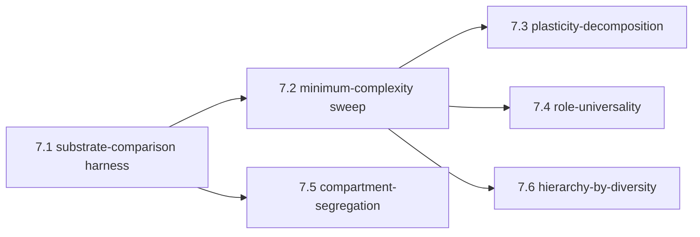

# Neuron Units: Minimal Complexity and Functional Basis

Status: design and future-work document. No code commitments in this increment.
Depends on: [docs/plan/inner_simulation_architecture.md](inner_simulation_architecture.md), [docs/plan/world_simulation.md](world_simulation.md), [docs/plan/celegans_graded_potential_design.md](celegans_graded_potential_design.md).

---

## 1. Purpose and scope

The inner simulation ([docs/plan/inner_simulation_architecture.md](inner_simulation_architecture.md)) and its dynamical refinement ([docs/plan/world_simulation.md](world_simulation.md)) both rest on a substrate of **processing units** — what we call neurons in this project, and what biology calls neurons in real nervous systems. Neither of those documents commits to what a neuron must be in order for the architecture above it to work. This document opens that question.

It commits to:

- A **vocabulary** for talking about a neuron unit's functional capabilities, distinct from any specific neuron model.
- A **functional basis** — the minimal set of capabilities a unit must support so that the inner simulation can be hosted on a substrate of such units.
- A **complexity spectrum** locating the project's existing neuron implementations along a single ordering from minimal to maximal.
- A **set of open questions** that further work must answer before the project can claim to know what minimum is sufficient for which behaviors.
- A **research program** — a sequence of comparative experiments that would answer those questions, expressed in terms specific enough to be turned into pytest probes.

It does not commit to:

- A new neuron class.
- A retirement of any existing neuron class.
- A choice of which neuron model the project's first running entity should use.
- Any change to the substrate engine.

The document is the project's place to think about what its atomic unit *is*, separately from the architecture above it and the substrate engine below it.

---

## 2. The question

The user-level statement is: *given the complexity of the nervous system an entity implements, what minimum-complexity processing unit (neuron) is sufficient to mimic what real neurons do, well enough that the inner simulation runs on a substrate of such units?*

The question has three parts that need to be separated.

1. **Mimicry.** What does a real neuron *do*, in functional terms — not in biophysical terms? A faithful biophysical model of a single neuron is one answer to "what is the minimum?", but it is not the *minimum*; it is the maximum. The minimum is the smallest set of functional capabilities below which the substrate ceases to support the inner simulation.

2. **Sufficiency for what.** "Sufficient" depends on what the substrate is being asked to do. A substrate that just produces brain-wave-shaped activity needs less than a substrate that supports a chemotaxis policy under hunger drive. The minimum is a function of the target behavior, not a single number.

3. **Universality across roles and contents.** The inner simulation calls for prediction units, error units, modulatable precision (cf. [docs/plan/inner_simulation_architecture.md](inner_simulation_architecture.md) §4.1, §4.5). On top of that, [docs/plan/world_simulation.md](world_simulation.md) §4 calls for the same neurons to participate, in succession and in parallel, in many different *ideas* — transient compositional patterns of activity whose identity is fixed by network-wide context, not by the neuron itself. Whether a single neuron-unit primitive can host all roles *and* all idea-memberships (the train-track-intersection picture), or whether different roles or content kinds require different unit types, is itself an open question.

Sections 3–5 develop the vocabulary needed to answer these. Sections 6–7 lay out the experiments that would actually answer them.

---

## 3. The functional basis

A **neuron unit** is the smallest entity in the substrate that has its own persistent state, integrates its inputs, and produces an output. Below is the catalog of functional capabilities a unit may or may not have. Each is named, defined, and given a status — *required* (the substrate cannot host the inner simulation without it), *strongly motivated* (without it, broad classes of behavior become impossible to produce), or *optional* (useful but not yet known to be necessary).

### 3.1 Input integration *(required)*

The unit must accept multiple input signals and combine them into a single internal driving quantity. The combination need not be linear, but it must be deterministic given the unit's state and current inputs, and it must respect arrival timing (inputs arriving simultaneously are not interchangeable with inputs arriving sequentially across multiple time steps).

Without integration, the unit's input is just one of its inputs at any moment, and the substrate has no way to compute coincidence, summation, or contrast. The substrate cannot host any non-trivial computation.

**Role-blindness and content-blindness as a positive design constraint.** The integration must be **content-blind**: the unit treats every incoming signal the same way, with no privileged channel for "this input belongs to idea A" or "this output is part of error-signal-of-sub-simulator B". The unit's job is local — sum the inputs, update the state, produce an output. The semantic identity of the activity passing through the unit is determined entirely by the network around it: which postsynaptic receivers are currently coherent, which precision is currently applied, which idea is currently active in the surrounding population (cf. [docs/plan/world_simulation.md](world_simulation.md) §4.4, "the neuron as train-track intersection"). A unit that *required* awareness of which idea or which sub-simulator role its current output participates in would be incompatible with this architecture; the same unit must be reusable across many roles and across many ideas, in succession and in parallel, with the surrounding network supplying the meaning.

### 3.2 Persistent internal state *(required)*

The unit must carry at least one scalar state variable across time steps. Voltage in conductance-based models, the leaky integrator's accumulated charge in LIF models, or an abstract activation in a simpler abstraction all qualify.

Without persistent state, the unit is memoryless: its output at time *t* depends only on its inputs at time *t*. A memoryless substrate cannot sustain recurrent activity ([docs/plan/world_simulation.md](world_simulation.md) §3.2), cannot host slow priors ([docs/plan/world_simulation.md](world_simulation.md) §5.1), and cannot place a signal in time. The inner simulation has nowhere to live.

### 3.3 Output generation *(required)*

The unit must produce an output that downstream synapses or gap junctions can consume. The output is a function of the current state and, in many models, of stochastic or threshold-mediated events.

Two output regimes appear in this project:

- **Spiking.** A discrete event emitted when the state crosses a threshold, followed by a reset and a refractory period. The output is a binary stream in time. Examples in the codebase: LIF ([src/sdmn/neurons/lif_neuron.py](../../src/sdmn/neurons/lif_neuron.py)), Hodgkin-Huxley ([src/sdmn/neurons/hh_neuron.py](../../src/sdmn/neurons/hh_neuron.py)).
- **Graded.** A continuous-valued signal whose magnitude is a smooth function of the state. The output is an analog stream in time. Examples in the codebase: graded neurons ([src/sdmn/neurons/graded/graded_neuron.py](../../src/sdmn/neurons/graded/graded_neuron.py)) and the C. elegans-specific multichannel neuron ([src/sdmn/neurons/graded/multichannel_neuron.py](../../src/sdmn/neurons/graded/multichannel_neuron.py)).

The two regimes differ in their information channel — discrete events versus continuous values — but both satisfy the "produce an output downstream can consume" requirement. The project's working position, taken from [docs/plan/celegans_graded_potential_design.md](celegans_graded_potential_design.md), is that the spike/graded distinction is a property of the entity being modeled, not of the substrate engine: C. elegans is graded, vertebrate cortex is mostly spiking, and the framework hosts both.

### 3.4 Bounded dynamics *(required)*

The unit's state must remain in a bounded range under any combination of inputs the substrate can produce. Numerically this is a stability requirement; functionally it is what stops the substrate from running away into a fixed-point absorbing state on the first strong input.

Three mechanisms supply bounded dynamics in the project's existing units:

- **Leak.** A passive return-to-rest current that grows with displacement from the resting state. Present in LIF, Hodgkin-Huxley, graded, and multichannel neurons.
- **Negative-feedback channels.** Outward currents activated by depolarization (potassium channels) or by intracellular calcium (Ca-dependent K), which oppose further excursion. Present in Hodgkin-Huxley, graded, and multichannel.
- **Numerical clipping.** A hard limit on voltage range. Used as a safety net in [src/sdmn/neurons/graded/graded_neuron.py](../../src/sdmn/neurons/graded/graded_neuron.py); not a substitute for biophysical stability, but a backstop for numerical pathology.

Bounded dynamics is required because an unbounded unit prevents the substrate from converging onto the natural manifold described in [docs/plan/world_simulation.md](world_simulation.md) §3.3.

### 3.5 At least one characteristic timescale *(required)*

A unit's persistent state has a time constant — the rate at which the state relaxes back to rest in the absence of input. This time constant places the unit on the temporal hierarchy of [docs/plan/inner_simulation_architecture.md](inner_simulation_architecture.md) §4.2 and on the stability axis of [docs/plan/world_simulation.md](world_simulation.md) §5.1.

A unit with no characteristic timescale has either instant relaxation (memoryless, fails 3.2) or no relaxation (no bounded dynamics, fails 3.4). Either is incompatible with hosting the inner simulation.

A unit with *one* characteristic timescale can participate in sub-simulators at exactly one level. Substrates whose units all share a single timescale produce only single-level inner simulations.

### 3.6 Multiple internal timescales *(strongly motivated)*

A unit with two or more state variables relaxing at different rates can participate in sub-simulators at multiple levels at once. The fast variable contributes to fast prediction; the slow variable contributes to slow prediction. The fast can drive the slow (depolarization gates calcium accumulation); the slow can gate the fast (calcium-dependent potassium currents shape excitability over time).

The Hodgkin-Huxley neuron supplies this through its gating variables; the multichannel neuron supplies it through its diverse channel families and intracellular calcium. The graded neuron without channels does not, and a substrate composed entirely of single-timescale units would limit the inner simulation to a single level of abstraction.

This is "strongly motivated" rather than "required" because, in principle, a single-timescale substrate could place units at different timescales by giving them different time-constant parameters. Whether that simulates the inner simulation as well as a substrate of multi-timescale units does is one of the open questions in section 6.

### 3.7 Modulatability *(required for inner simulation)*

The unit's input-output transfer must be **gain-controllable** by an external signal that is not just another input. Without an extra-input gain channel there is no clean way to implement precision (cf. [docs/plan/inner_simulation_architecture.md](inner_simulation_architecture.md) §4.4 and §4.5), no clean way to implement the priority field of [docs/plan/world_simulation.md](world_simulation.md) §6.3, and no clean way to implement focus shifts. Everything still nominally works, but the implementation cannot route gain control without entangling it with the signal it is supposed to gate.

In the existing codebase, modulatability arrives in two forms:

- **Per-synapse modulation** — multiplicative gain on a synapse's weight, modulated by a signal independent of the synapse's pre- and post-cells.
- **Per-neuron modulation** — change to the unit's leak conductance, threshold, or reversal potential, modulated by an extrasynaptic concentration. Hosted by [src/sdmn/neurons/graded/neuropeptide_layer.py](../../src/sdmn/neurons/graded/neuropeptide_layer.py).

A unit that supports neither cannot serve as a sub-simulator's prediction or error neuron when precision must vary. Modulatability is therefore required if the substrate is meant to host the inner simulation. A substrate that only ever needs to compute a fixed transfer function does not need it.

### 3.8 Plasticity *(strongly motivated)*

The unit must support, somewhere in its dynamics, a slow variable that changes with the unit's activity history and that affects the unit's input-output transfer. This is plasticity — at the synapse, at the unit's intrinsic excitability, or both.

Plasticity is the substrate's contribution to the slow learning loop ([docs/plan/inner_simulation_architecture.md](inner_simulation_architecture.md) §4.4). Without plasticity at any level, the substrate cannot learn — meaning the inner simulation's generative model never improves, slow priors never form by experience, and learned focus patterns are impossible.

Plasticity is "strongly motivated" rather than "required" because the project may run experiments in which plasticity is deliberately turned off, to study the substrate's behavior at fixed weights. But a substrate that *cannot* support plasticity at all has no path to becoming a learning entity.

### 3.9 Stochasticity *(useful, narrower role than it might seem)*

The unit's behavior should include a controlled stochastic component — channel noise, synaptic-release noise, or background-current noise.

The role of unit-level stochasticity is more limited than a quick reading of "the substrate needs a seed" might suggest. Biology achieves the always-on substrate primarily through persistent sensory baselines (sensors are never silent; even an immobilized worm in a controlled buffer is detecting baseline temperature, ions, posture, and contact) plus recurrent loop sustenance through the small-world connectome — *not* through unit-level noise (cf. [docs/plan/world_simulation.md](world_simulation.md) §3.2). Unit-level stochasticity contributes mainly to:

- **Tie-breaking** in an otherwise deterministic substrate when two competing patterns are equally favoured.
- **Cold-starting** a simulation that has not yet developed sensory drive — relevant to the simulation, not to the biology.
- **Trial-to-trial variability** that biological nervous systems show but that a purely deterministic simulation cannot exhibit.
- **Channel-level realism** in models that aim at biophysical fidelity rather than functional fidelity alone.

Stochasticity at the unit level is therefore *useful*, but it is not the always-on mechanism the architecture above relies on. A purely deterministic substrate, given realistic sensory baselines and the C. elegans connectome, should already be always-on.

A purely deterministic substrate is a useful diagnostic and reproducibility tool, and the existing graded neuron supports running with noise turned off. But a substrate with no stochastic option — no noise channel even available — cannot host an entity that explores novel behaviors and cannot exhibit the variability biological nervous systems produce. The "useful" status above replaces this section's earlier "strongly motivated" status, in light of the biology summarized in [docs/plan/world_simulation.md](world_simulation.md) §3.2.

### 3.10 Spatial structure *(optional)*

Real neurons are spatially extended objects with dendrites, soma, and axon, and each compartment contributes differently to integration and output. Hodgkin-Huxley, graded, and multichannel neurons in this project are all single-compartment ("point") models, treating the unit as a single state-variable entity.

Multi-compartment models (apical/basal dendrite separation in pyramidal cells; segregated input streams) are increasingly relevant in modern theory ([docs/plan/IDEAS.md](IDEAS.md), "Bidirectional Inter-Layer Communication", under "Dendritic Localized Learning"). The project does not yet have a multi-compartment unit. Whether the inner simulation can be hosted without one is an open question.

---

## 4. The functional basis, summarized

| Capability | Section | Status | Carried by |
|---|---|---|---|
| Input integration | 3.1 | Required | All existing models |
| Persistent state | 3.2 | Required | All existing models |
| Output generation (spike or graded) | 3.3 | Required | All existing models |
| Bounded dynamics | 3.4 | Required | All existing models |
| At least one characteristic timescale | 3.5 | Required | All existing models |
| Multiple internal timescales | 3.6 | Strongly motivated | HH, multichannel; not graded-base or LIF |
| Modulatability (external gain channel) | 3.7 | Required for inner simulation | Multichannel + extrasynaptic layer; partial in others |
| Plasticity | 3.8 | Strongly motivated | Partial — STDP scaffolding in [src/sdmn/visualization/fast_sim.py](../../src/sdmn/visualization/fast_sim.py); not unit-level |
| Stochasticity | 3.9 | Useful (narrower role than once thought; cf. [docs/plan/world_simulation.md](world_simulation.md) §3.2) | Configurable in graded and multichannel; absent by default in LIF, HH |
| Spatial structure | 3.10 | Optional / open question | None yet |

A unit that has the *required* capabilities is a viable substrate primitive. A unit that has the *required* and *strongly-motivated* capabilities is a substrate primitive on which the inner simulation can fully run, with a learning loop. The always-on regime is, in this project's framing, primarily a property of the connectome plus realistic sensory baselines (cf. [docs/plan/world_simulation.md](world_simulation.md) §3.2) rather than a unit-level capability — which is why "stochasticity" is listed as *useful* rather than *strongly motivated* in the table above.

---

## 5. The complexity spectrum

The existing neuron implementations in [src/sdmn/neurons/](../../src/sdmn/neurons/) sit at different points on a single spectrum from minimal to maximal complexity. Locating them on the spectrum makes it explicit what the project gains and loses by choosing one over another for a given experiment.

| Position | Implementation | Required capabilities (3.1–3.5) | Multi-timescale | Modulatable | Plastic | Stochastic | Spatially structured |
|---|---|---|---|---|---|---|---|
| Minimal viable | Threshold-only abstraction (not in codebase) | Yes (degenerate state) | No | No | No | No | No |
| Standard point | LIF ([lif_neuron.py](../../src/sdmn/neurons/lif_neuron.py)) | Yes | No | Indirectly via params | Synaptic only | Off by default | No |
| Standard point + ion channels | Hodgkin-Huxley ([hh_neuron.py](../../src/sdmn/neurons/hh_neuron.py)) | Yes | Yes (gating variables) | Indirectly via params | Synaptic only | Off by default | No |
| Graded base | Graded ([graded_neuron.py](../../src/sdmn/neurons/graded/graded_neuron.py)) | Yes | No (single time constant) | Yes (current injection) | Synaptic only | Configurable | No |
| Graded with channels | C. elegans graded ([celegans_neuron.py](../../src/sdmn/neurons/graded/celegans_neuron.py)) | Yes | Yes (Ca, K, KCa kinetics) | Yes (extrasynaptic-ready) | Synaptic only | Configurable | No |
| Graded with channel diversity | Multichannel ([multichannel_neuron.py](../../src/sdmn/neurons/graded/multichannel_neuron.py)) | Yes | Yes (multiple channel families) | Yes | Synaptic only | Configurable | No |
| Multi-compartment | Not in codebase | — | — | — | — | — | Yes |

A few observations the table makes explicit.

- The project's existing units span "standard point" through "graded with channel diversity" but are all single-compartment. The multi-compartment slot is an open frontier.
- Plasticity in the existing units is *synaptic*, hosted at the synapse rather than the unit. None of the existing units intrinsically adapts its excitability over the slow timescales relevant to learning. Intrinsic plasticity is one of the candidate items for unit-level future work (section 7.4).
- The spectrum has more rungs than just "spiking versus graded". The graded-base, graded-with-channels, and multichannel implementations are three rungs that all sit in the graded regime but at very different levels of biophysical specificity.

The question "what is the minimum-complexity unit?" therefore decomposes into "what is the minimum *position on this spectrum* sufficient for the target behaviors?", which is empirically answerable.

---

## 6. Open questions

Each of the following is a question the project does not yet have an answer to. Each is amenable to a comparative experiment using existing or proposed units.

### 6.1 Is intrinsic plasticity necessary, or is synaptic plasticity sufficient?

Synaptic plasticity changes the weights between units; intrinsic plasticity changes a unit's input-output transfer. The literature includes both ([docs/plan/IDEAS.md](IDEAS.md), "Bidirectional Inter-Layer Communication"; section 6.2 there of intrinsic plasticity in homeostatic regulation). Whether the project needs to add intrinsic plasticity to its units, or can do everything required by the inner simulation through synaptic plasticity alone, is unresolved.

A direct experiment: train two substrates of the same connectome, one with synaptic plasticity only, the other with synaptic plus intrinsic plasticity. Run them on a chemotaxis benchmark with environment changes. Compare the speed and stability of adaptation.

### 6.2 Is multi-compartment structure necessary?

Dendritic Localized Learning (Li et al. 2025; cf. [docs/plan/IDEAS.md](IDEAS.md)) argues that segregating feedforward and feedback inputs across compartments solves the weight-transport problem of backpropagation in a biologically plausible way. Whether the inner simulation needs that segregation, or can be hosted by point neurons given enough connectivity, is unresolved.

A direct experiment: implement a minimal multi-compartment model with apical-basal segregation; run a sub-simulator's prediction and error roles on the two compartments respectively; compare its performance and biological correlate to the equivalent point-neuron implementation that uses connectivity to keep the roles separate.

### 6.3 Can a single unit type host all sub-simulator roles, and all ideas?

The inner simulation has prediction units, error units, and precision-modulating populations ([docs/plan/inner_simulation_architecture.md](inner_simulation_architecture.md) §4.1, §4.4). On top of that, [docs/plan/world_simulation.md](world_simulation.md) §4 commits the project to a stronger position: the same neurons must, over time and in overlap, participate in many different *ideas* — transient compositional activity patterns whose identity is fixed by network-wide context, not by the neuron itself. The neuron is a train-track intersection ([docs/plan/world_simulation.md](world_simulation.md) §4.4), routing whichever train is currently aligned through it without representing which train is which.

Two related questions follow:

- **Role universality.** Can a single unit type host the prediction, error, and precision-broadcast roles of the inner simulation, with role membership determined by connectivity rather than by unit type?
- **Content universality.** Can a single unit type participate, over time and in overlap, in arbitrarily many ideas, with idea membership determined by the surrounding population state rather than by the unit's own identity?

Working hypothesis ([docs/plan/inner_simulation_architecture.md](inner_simulation_architecture.md) §5.5, [docs/plan/world_simulation.md](world_simulation.md) §4.6): yes to both. No specialization is required at the unit level; roles are connectivity-defined and idea-memberships are network-defined. The current codebase is consistent with this. A direct test of the role-universality side builds a sub-simulator with prediction, error, and precision roles all played by units of the same type and verifies the architecture's observables (cf. [docs/plan/inner_simulation_architecture.md](inner_simulation_architecture.md) §7) emerge. A direct test of the content-universality side records single-unit activity in a substrate hosting many ideas and checks for the multi-idea participation signature ([docs/plan/world_simulation.md](world_simulation.md) §10.4).

If either test fails, the project will know it needs role-specialized or content-specialized units. If both succeed, the train-track-intersection picture is, for this entity, the right one.

### 6.4 What is the lowest-complexity unit that supports a working inner simulation?

This is the headline question. The complexity spectrum of section 5 invites a sweep: build the same sub-simulator topology with units of progressively lower complexity (multichannel → graded with channels → graded base → LIF) and measure where the inner-simulation observables collapse.

The cost-benefit question this answers is real: lower-complexity units run faster, scale further, and require less parameter tuning. If the inner simulation can be hosted on a substrate of LIF or graded-base units for the C. elegans-class entity, that is a meaningful simplification. If it cannot, the project knows it needs at least the graded-with-channels rung for that entity.

### 6.5 Does the timescale hierarchy require multi-timescale units, or can single-timescale units span it through diversity of parameters?

A substrate of single-timescale units, each given a different time-constant parameter, can in principle place units at different positions on the timescale axis of [docs/plan/world_simulation.md](world_simulation.md) §5.1. Whether the resulting hierarchy is functionally equivalent to a hierarchy built from multi-timescale units (each contributing fast and slow components) is unresolved.

A direct experiment: build the same level-stratified sub-simulator topology twice, once on multichannel units that intrinsically span multiple timescales and once on a population of single-timescale units with diverse parameters chosen to match the multichannel population's spectral profile. Compare the substrates on observables sensitive to the temporal hierarchy ([docs/plan/inner_simulation_architecture.md](inner_simulation_architecture.md) §7.6).

### 6.6 How critical is unit-level stochasticity, and at which level?

The biological evidence summarized in [docs/plan/world_simulation.md](world_simulation.md) §3.2 (small-world recurrent connectome plus persistent sensory baselines; whole-brain calcium imaging showing pervasive ongoing activity in immobilized worms) suggests the always-on substrate is mostly carried by Tier 1 (sensory baselines) and Tier 2 (recurrent loops) rather than by unit-level noise. The remaining question is whether unit-level stochasticity is necessary at all once realistic sensory baselines and the connectome are in place, or whether it is dispensable for the always-on condition and only matters for trial-to-trial variability and tie-breaking.

A direct experiment: with the implementation path of [docs/plan/world_simulation.md](world_simulation.md) §8.1 in place (Tier 1 and Tier 2 active, realistic sensory baselines configured), run the same connectome with four stochasticity configurations:

1. **Unit-level noise on every neuron** (current default for graded models with noise enabled).
2. **Unit-level noise restricted to a small set of injector populations** (sensors only, or sensors plus a handful of interneuron hubs).
3. **No unit-level noise; rely on sensory baselines and recurrent dynamics alone** — including, optionally, deterministic chaos from the recurrent dynamics as the source of variability.
4. **Deterministic chaotic input from a Lorenz-like generator** as a designed alternative to channel noise.

Compare the resulting always-on manifolds (cf. [docs/plan/world_simulation.md](world_simulation.md) §10.1) and the trial-to-trial variability of the entity's behavior. If (3) is indistinguishable from (1) on the always-on observables but differs in trial-to-trial variability, the project will know that unit-level stochasticity is dispensable for the always-on condition itself and matters only as a source of behavioral variability — which sharpens both the unit-level requirements of section 3.9 and the implementation goals of [docs/plan/world_simulation.md](world_simulation.md) §8.1 Tier 3.

### 6.7 Are spike and graded outputs functionally equivalent for the inner simulation?

The project hosts both. For C. elegans, graded is the biological default. For higher entities, spiking is the biological default. Whether the inner simulation's mechanics are fundamentally the same between the two, or whether spike timing has a functional role that graded outputs cannot replicate (e.g., for STDP-driven learning), is unresolved at the level of the project's framework.

A direct experiment: build the same sub-simulator on a population of LIF neurons (spiking) and on a population of equivalent graded neurons with matched mean firing rates, and compare their performance on a learning benchmark and on the inner-simulation observables.

---

## 7. Future work: a research program

The open questions of section 6 are not equally tractable, and they share infrastructure. This section orders them into a research program that the project can execute when it chooses to.

### 7.1 Build the substrate-comparison harness

Before any of the section-6 experiments can run, the project needs an infrastructure piece: the ability to run *the same connectome with the same learning rule* on different unit types, and to compute the inner-simulation observables ([docs/plan/inner_simulation_architecture.md](inner_simulation_architecture.md) §7, [docs/plan/world_simulation.md](world_simulation.md) §10) across all of them.

This harness is a code increment, not a research result. Its requirements are:

- A clean factory for instantiating a connectome with a chosen unit type and matched parameters.
- A standard set of input protocols (constant, step, ramp, surprise, contextual switch).
- A standard probe set for the inner-simulation observables.
- A reporting layer that produces the same plots and metrics across runs, so substrates can be compared without per-substrate plumbing.

Once the harness exists, sections 7.2–7.5 are reduced to sweeping its parameters.

### 7.2 The minimum-complexity sweep (question 6.4)

The first experiment is the headline sweep. Run the same C. elegans-scale sub-simulator topology on each rung of the complexity spectrum (section 5) and record the inner-simulation observables. The lowest rung at which all required observables remain above their falsifier threshold is the project's empirical answer to the minimum-complexity question for that entity.

This sweep is the most informative single result the project can produce on neuron-unit choice. It should be executed before any other unit-level question.

### 7.3 The plasticity-decomposition study (question 6.1)

Once 7.2 has identified the minimum sufficient complexity, run the same substrate with three plasticity configurations: synaptic only, intrinsic only, both. Record the speed and stability of adaptation on a chemotaxis benchmark with mid-experiment environment changes.

This study answers, for a given substrate complexity, where in the unit the slow learning loop must live.

### 7.4 The role-universality test (question 6.3)

Build a sub-simulator whose prediction, error, and precision populations are all the same unit type (the result of 7.2). Verify that the inner-simulation observables emerge under the connectivity-only role assignment of [docs/plan/inner_simulation_architecture.md](inner_simulation_architecture.md). If they do not, the project will know it needs role-specialized units.

### 7.5 The compartment-segregation study (question 6.2)

Implement a minimal multi-compartment unit with apical-basal segregation. Run it as the substrate for a sub-simulator and compare the inner-simulation observables (especially the prediction/error separation cleanliness) against the equivalent point-neuron substrate. If multi-compartment cleanliness is dramatically higher, the project will have empirical motivation to move multi-compartment from "optional" to "strongly motivated".

### 7.6 The hierarchy-by-diversity study (question 6.5)

With the minimum-complexity multi-timescale unit on one side and a parameter-diverse population of single-timescale units on the other, compare hierarchical-observable signatures. If the diverse-population substrate matches the multi-timescale substrate, the project will know its temporal hierarchy is implementable on simpler units. If it does not, the project will know multi-timescale units are essential.

### 7.7 Dependency order

7.1 must come first; it is the precondition for everything else. 7.2 is the headline result and should be the next priority. 7.3 and 7.4 can be parallelized once 7.2 has chosen the substrate; both are constant in the chosen substrate. 7.5 is independent of the others and can run on any schedule. 7.6 should follow 7.2 because it depends on knowing what the minimum complexity actually is.

---

## 8. Mapping to existing code

| Item in this document | Existing code |
|---|---|
| Functional basis 3.1–3.5 | All neuron base classes: [base_neuron.py](../../src/sdmn/neurons/base_neuron.py), [lif_neuron.py](../../src/sdmn/neurons/lif_neuron.py), [hh_neuron.py](../../src/sdmn/neurons/hh_neuron.py), [graded_neuron.py](../../src/sdmn/neurons/graded/graded_neuron.py) |
| Multi-timescale (3.6) | [hh_neuron.py](../../src/sdmn/neurons/hh_neuron.py), [celegans_neuron.py](../../src/sdmn/neurons/graded/celegans_neuron.py), [multichannel_neuron.py](../../src/sdmn/neurons/graded/multichannel_neuron.py) |
| Modulatability (3.7) | Per-synapse via [graded_synapse.py](../../src/sdmn/synapses/graded_synapse.py); per-neuron via [neuropeptide_layer.py](../../src/sdmn/neurons/graded/neuropeptide_layer.py) |
| Plasticity (3.8) | Partial scaffolding in [fast_sim.py](../../src/sdmn/visualization/fast_sim.py); no unit-level plasticity yet |
| Stochasticity (3.9) | Configurable in [graded_neuron.py](../../src/sdmn/neurons/graded/graded_neuron.py) and [multichannel_neuron.py](../../src/sdmn/neurons/graded/multichannel_neuron.py) |
| Spatial structure (3.10) | Not present |
| Complexity spectrum (5) | Each row maps to its file in [src/sdmn/neurons/](../../src/sdmn/neurons/) |
| Substrate-comparison harness (7.1) | Does not exist yet; would live in a new module |

The harness (7.1) is the only item in the document that requires a new code path. Everything else either already exists in the codebase, is an experiment that uses what exists, or is a future option that the project explicitly leaves open.

---

## 9. Terminology

| Term | Meaning in this document |
|---|---|
| Unit / neuron unit | The atomic processing element of the substrate, one row of section 5's table. |
| Functional basis | The set of capabilities (3.1–3.10) a unit may or may not have. |
| Required capability | A capability without which the substrate cannot host the inner simulation. |
| Strongly-motivated capability | A capability without which broad classes of behavior become impossible. |
| Optional capability | A capability that may matter for richer entities but is not yet known to be necessary. |
| Complexity spectrum | The ordering of section 5; from minimal viable through multi-compartment. |
| Substrate-comparison harness | The infrastructure piece (7.1) for running the same connectome on different unit types. |
| Minimum-complexity sweep | The headline experiment (7.2) that empirically identifies the smallest sufficient complexity for a given entity. |

These terms are local to this document; they do not override the project-wide terminology lock in [docs/plan/inner_simulation_architecture.md](inner_simulation_architecture.md) §6.

---

## 10. Non-goals

This document does not specify:

- A new neuron class or a refactor of existing ones.
- A choice of unit type for the project's first running entity. That choice is one of the outputs of 7.2, not one of its inputs.
- A schedule for executing the research program of section 7.
- A new abstraction layer above the existing neuron base class. The functional basis of section 3 is a vocabulary for talking about capabilities, not a class hierarchy.
- A claim that any specific unit (LIF, HH, graded, multichannel) is the right one. The project takes the position that this is empirically resolvable and not yet resolved.
- A claim about consciousness or about which unit complexity is required for it. The complexity required to host the inner simulation is a different question from any consciousness-related question, and this document does not engage with the latter.

The next logical document, once the harness of 7.1 is built, is the report from the minimum-complexity sweep of 7.2 — at which point the project will have its first empirical answer to the question this document opens.
