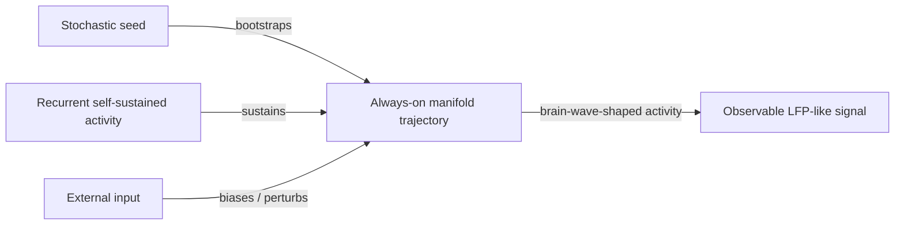
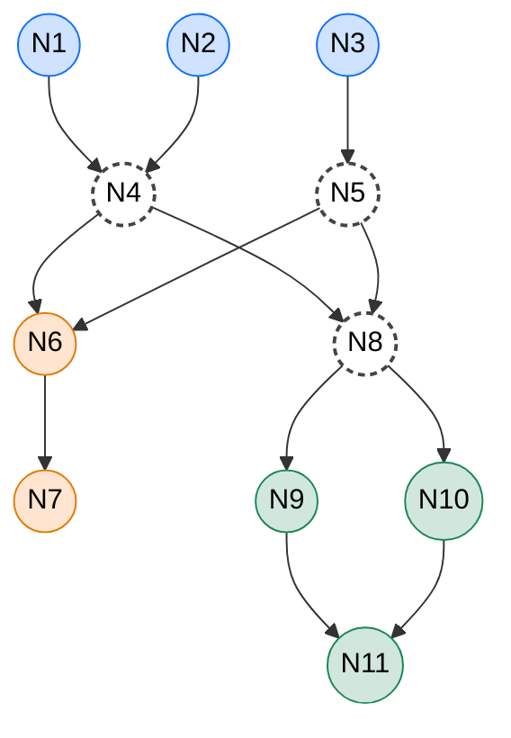
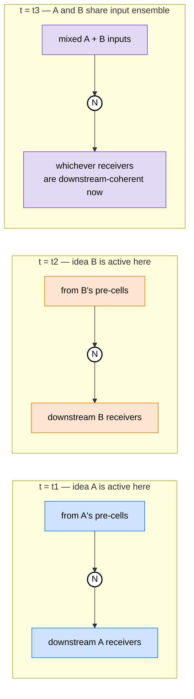
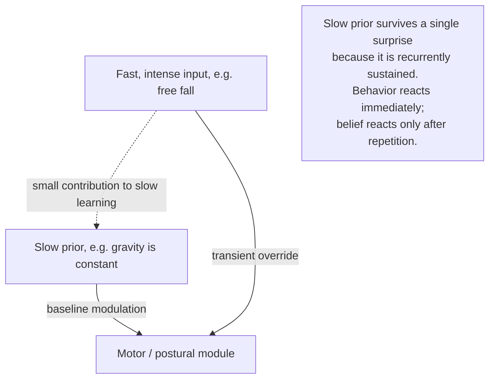
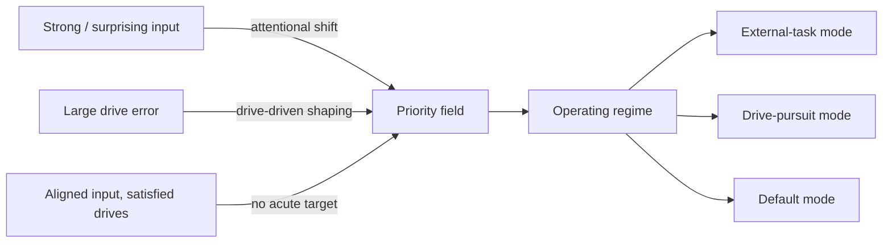

# World Simulation

Status: design document. No code commitments in this increment.
Depends on: docs/TWO_SIMULATIONS.md, docs/plan/inner_simulation_architecture.md.
Companion: docs/plan/neuron_units.md.

---

## 1. Purpose and scope

This document specifies the **world simulation** the running entity carries inside it, as a working refinement of the inner simulation. Where inner_simulation_architecture.md sets the formal frame (sub-simulators, levels, modules, prediction-error-precision mechanics), this document commits to the **dynamics** that make that frame run on a real substrate:

- How signals propagate, decay, regenerate, and circulate through layered processing units.
- Why the substrate must be **always on**, how biology gets there (persistent sensory baselines plus recurrent loops in the connectome), and what role injected supplementary drive should play (a backstop for unmodelled biology, not the primary mechanism).
- What an **idea** is, operationally: a transient compositional pattern of activity that overlaps with other ideas in the substrate, that single neurons participate in without awareness, and whose identity is fixed by network-wide context — the train-track-intersection picture.
- How **priors of different stability** (gravity, light, "food just ahead", "something is biting me right now") are organized along a **timescale axis**, and how that axis becomes the operational meaning of "level of abstraction".
- How **drives** — pain, hunger, threat, and the abstract drives composed from them — set the **priority field** that decides which ideas get amplified at any moment.
- What the **default mode** is, mechanically: the regime entered when external drive aligns with internal expectation and the priority field stops being externally pushed.
- What it takes to demonstrate this on the project's first entity, the C. elegans connectome.

The document is intentionally less abstract than inner_simulation_architecture.md. It is the place where the project commits to operational claims that can be falsified by running an entity, not just by reading a paper.

It does not commit to:

- Specific data structures, classes, or files.
- A specific learning rule.
- A particular set of source files to change.

Those remain deferred to a code-design increment.

---

## 2. Relation to the existing architecture documents

| Document | Role | This document's role relative to it |
|---|---|---|
| [docs/TWO_SIMULATIONS.md](../TWO_SIMULATIONS.md) | Names the split between substrate engine and inner simulation. | This document lives strictly on the inner-simulation side of that split. It does not change the substrate engine's responsibilities. |
| [docs/plan/inner_simulation_architecture.md](inner_simulation_architecture.md) | Frames the inner simulation as predictive coding / active inference, defines the sub-simulator unit, the abstraction levels, the functional modules, and the prediction-error-precision signal types. | This document is its dynamics-and-priors layer: it specifies how propagation, decay, regeneration, drive and priority work *inside* that frame. Terminology from inner_simulation_architecture.md is adopted unchanged. |
| [docs/plan/self_awareness_architecture.md](self_awareness_architecture.md) | Higher-level research and ethics framing for self-related sub-simulators. | This document treats self-related sub-simulators no differently from any other sub-simulator. The drives in section 6 include self-state-related drives without elevating them. |
| [docs/plan/IDEAS.md](IDEAS.md) | Informal antecedent for the intuitions in this document. | Sections 4, 5, and 6 here formalize the "always-on simulation", "intrinsic simulation as content", "context switching", and "convictions vs short-term beliefs" intuitions found there. |
| [docs/plan/architecture.md](architecture.md) | The substrate engine architecture. | Not changed by this document. The substrate engine remains a numerical integrator. |

When this document and inner_simulation_architecture.md disagree on architecture, inner_simulation_architecture.md wins. When this document refines a claim that inner_simulation_architecture.md left under-specified, this document wins. The two are intended to be read together.

---

## 3. The world simulation as ongoing dynamics

The substrate engine integrates voltages and synaptic state. The inner simulation, sitting *in* those neurons, behaves as a continuously-updated generative model of body and world. This section commits to what that "continuously-updated" actually means as activity dynamics.

### 3.1 Layered propagation, decay, and regeneration

Sensory input enters the substrate as current injected into a small set of receptor-adjacent neurons. From there it propagates through whatever connectivity exists, with three properties that matter for the world simulation:

1. **Decay along the path.** Each synaptic step attenuates the signal: synaptic conductance is finite, postsynaptic membranes leak, dendritic integration is sub-linear in many regimes. A pulse injected at a sensor that traversed the network unchanged would be a symptom of a broken substrate, not a healthy one.

2. **Regeneration at downstream stages.** A neuron at depth `k` that has been driven into its excitable regime by the arriving signal can produce its own outgoing signal, with amplitude set by its intrinsic dynamics rather than by the residual amplitude of the input. This is the standard role of voltage-gated channels (Section 4 of [docs/plan/celegans_graded_potential_design.md](celegans_graded_potential_design.md)). Regeneration is *not* faithful copying; it is shape-restoration biased by the receiver's own state.

3. **Cyclic re-entry.** The substrate this project targets is explicitly cyclic. A signal that propagated three hops "outward" from a sensor will, with substantial probability, re-enter the same neighborhood from a different direction, with a delay set by path length and synaptic kinetics. The signal a neuron receives at time *t* is therefore a mixture of (a) what is currently arriving from sensors, (b) what is currently arriving from neighbors driven by earlier sensor input, and (c) what is currently arriving from neighbors driven by the entity's own past activity.

The functional consequence is that the same downstream activity pattern can be sustained by external drive, by recirculating internal drive, or by a mixture of both, and a healthy substrate cannot tell the difference at the level of individual neurons. Whether the activity *means* "current observation" or "ongoing prediction" is a property of the sub-simulator the activity participates in, not of the activity itself. Section 6 of [docs/plan/inner_simulation_architecture.md](inner_simulation_architecture.md) calls this the **shared world estimate**: there is no single neuron that "knows" whether it is observing or predicting.

### 3.2 The always-on substrate

A sub-simulator that stops firing in the absence of input cannot maintain a generative model. It has no ongoing expectation to compare against incoming observation, no precision allocation that survives a quiet period, and no rehearsal of recent or projected states.

The substrate must therefore satisfy an **always-on condition**: at every point in time, at least some neurons in every sub-simulator are above their firing or graded-release thresholds, even when the experimental setup is delivering no controlled stimulus. This is not a top-down design preference; it is a requirement that follows from the inner simulation being a process rather than an object.

Two facts about how biology meets the always-on condition shape what the project commits to. They are not aspirational; they are how it actually works in C. elegans, the project's first entity.

**"Zero sensory input" is not a biological state.** Even an immobilized worm in a controlled buffer is detecting baseline temperature, baseline ion concentration, body posture (proprioception via stretch receptors in body-wall muscles and DVA), and ambient mechanical contact with the substrate. Sensory neurons are never silent: their activity has a non-zero baseline driven by ambient stimuli plus intrinsic channel noise, and it is *modulated* by experimenter-controlled stimuli rather than switched on by them. The substrate's "input layer" is therefore *always providing some drive*, regardless of what the experimental setup is asked to deliver.

**Every neuron is in recurrent loops.** The C. elegans connectome (White et al. 1986; Varshney et al. 2011; whole-animal Cook et al. 2019) is a small-world network with average path length ~2–3 hops and high clustering — Watts & Strogatz (1998) used it as one of their three canonical small-world examples. Most neurons (~80%) are not sensory; they are interneurons whose inputs come predominantly from other neurons. Even sensory neurons receive feedback (AWC and AFD chemo/thermosensory receive interneuron feedback that controls adaptation; ASH nociceptor is heavily monoamine-modulated). Whole-brain calcium imaging in immobilized worms (Schrödel et al. 2013; Kato et al. 2015) and in moving worms (Nguyen et al. 2016) consistently shows most neurons active most of the time, organized into low-dimensional population states that cycle through a small set of regimes — exactly the always-on, manifold-traversing dynamics this section needs.

The always-on condition therefore has three sources, in decreasing order of how much load they carry.

**1. Persistent sensory baselines (primary).** Sensor-adjacent neurons receive non-zero drive at all times from ambient stimuli plus channel noise. This is *not* a separate mechanism layered on top of normal sensing; it is what biological sensing actually does. The substrate engine should preserve this — sensory neurons should have a baseline drive consistent with their biological tonic activity, not a "stimulus or zero" model where the input layer goes silent whenever the experimenter is not delivering something. Ambient baseline is itself a stimulus.

**2. Recurrent loop sustenance (primary).** The cyclic, small-world connectivity of the connectome propagates and sustains whatever activity arrives at any of its nodes: a neuron drives its neighbours, which drive their neighbours, which after a delay drive the original neuron. Every interneuron and every motor neuron is in multiple recurrent loops, and even sensory neurons participate in sensorimotor closure (sensor → interneuron → motor → body movement → proprioception → sensor). The connectome by itself, fed only by realistic sensory baselines, is enough to keep the substrate occupied. This is the principal mechanism of within-second persistence in this project's substrate, and it requires no new code beyond what `ConnectomeLoader` already wires.

**3. Supplementary tonic and stochastic drive (auxiliary).** The substrate engine does not yet model every source of biological tonic input — slow neuromodulatory tone, ambient gap-junction-mediated electrical leakage from the network as a whole, pacemaker conductances. A small standing depolarizing current and a small zero-mean current noise on cell-types known to receive such input stand in for what the engine is silent on. This is a *backstop*, not the project's claim about how always-on is realized.

The two primary mechanisms carry most of the load. The auxiliary mechanism only needs to fill the gap left by what the engine doesn't yet model — and as the engine grows (e.g., as Phase 6 "Neuromodulation System" of [docs/IMPLEMENTATION_PLAN.md](../IMPLEMENTATION_PLAN.md) lands), the auxiliary mechanism's role shrinks. The existing DMN injection in [src/sdmn/networks/celegans/network_manager.py](../../src/sdmn/networks/celegans/network_manager.py) (`DMNConfig`) and [src/sdmn/visualization/live_visualizer.py](../../src/sdmn/visualization/live_visualizer.py) is the primitive form of source 3, repositioned by this document from "the way always-on works" to "the residual that compensates for unmodelled biology".

Selected references for this section:

- White, J.G. et al. (1986). "The structure of the nervous system of the nematode Caenorhabditis elegans." *Phil. Trans. R. Soc. B*, 314(1165), 1–340.
- Watts, D.J. & Strogatz, S.H. (1998). "Collective dynamics of 'small-world' networks." *Nature*, 393(6684), 440–442.
- Varshney, L.R. et al. (2011). "Structural properties of the *Caenorhabditis elegans* neuronal network." *PLOS Comput. Biol.*, 7(2), e1001066.
- Schrödel, T. et al. (2013). "Brain-wide 3D imaging of neuronal activity in *Caenorhabditis elegans* with sculpted light." *Nature Methods*, 10(10), 1013–1020.
- Kato, S. et al. (2015). "Global brain dynamics embed the motor command sequence of *Caenorhabditis elegans*." *Cell*, 163(3), 656–669.
- Nguyen, J.P. et al. (2016). "Whole-brain calcium imaging with cellular resolution in freely behaving *Caenorhabditis elegans*." *PNAS*, 113(8), E1074–E1081.
- Cook, S.J. et al. (2019). "Whole-animal connectomes of both *Caenorhabditis elegans* sexes." *Nature*, 571(7763), 63–71.
- Randi, F. et al. (2023). "Neural signal propagation atlas of *Caenorhabditis elegans*." *Nature*, 623(7986), 406–414.

### 3.3 Stochastic seed and brain-wave shape

Activity that is sustained by recurrent connectivity around a stochastic seed has a characteristic spectral signature: it is **not noise**, and it is **not a fixed-point attractor**. It is a structured, low-dimensional fluctuation across a small number of meta-stable regimes — the same kind of fluctuation that appears in biological brain-wave recordings.

This document commits to two claims about the shape of always-on activity in the entities this project simulates:

1. The intrinsic dynamics of a healthy always-on substrate live on a low-dimensional manifold whose geometry is set by the connectome. The principal directions of that manifold are functional in the sense of section 4: each is the activity pattern of a sub-simulator running at its natural amplitude.

2. External input does not replace the intrinsic dynamics; it **biases the trajectory** along the manifold and occasionally, for sufficiently strong or surprising input, pushes the trajectory off the manifold transiently — which is the substrate-level signature of a prediction error.

This connects directly to the "Brain Waves as Online Learning Mechanism" section of [docs/plan/IDEAS.md](IDEAS.md). The claim is that the brain waves the project ultimately wants to produce are not generated by an oscillator subsystem; they are the manifold's natural traversal under the always-on condition, plus the perturbations imposed by current observation.

A substrate without the seed never starts. A substrate without recurrent sustenance dies the moment input ceases. A substrate without input drifts on its own manifold indefinitely — which is the regime the project will recognize as the **default mode** (section 6.4).

### 3.4 Where input contributes, where it does not

Input matters when it disagrees with what the always-on dynamics were producing. When input agrees, it is absorbed into the manifold and barely changes the trajectory. The project's working claim is therefore:

- **Input as confirmation** is mechanically the same as no input. The trajectory continues; precision on the relevant module relaxes; the entity proceeds with whatever it was already doing.
- **Input as correction** perturbs the trajectory. Error-unit activity rises in modules that "see" the correction; precision reallocates (section 6); the trajectory is pulled toward a new attractor on the manifold.
- **Input as surprise** transiently pushes the trajectory off the manifold. Error-unit activity bursts; precision spikes; the system either rapidly re-finds the manifold by absorbing the input into an existing sub-simulator's expectations, or, if the surprise persists, the manifold itself is reshaped by learning (section 4 of [docs/plan/inner_simulation_architecture.md](inner_simulation_architecture.md), §4.4 "two loops, two timescales").

This three-way classification is operational. It can be tested by a probe that computes, on a short window, the projection of substrate activity onto the always-on manifold and the orthogonal residual. Confirmation, correction, and surprise then have measurable signatures on those two components.

---

## 4. Ideas as transient compositional patterns

Section 3 specified how the substrate propagates and sustains activity. [docs/plan/inner_simulation_architecture.md](inner_simulation_architecture.md) §4 organizes that activity into sub-simulators with prediction, error, and precision roles. This section commits to a third claim — between the propagation and the architecture — about **what the activity *is*, viewed as content**.

The user-level intuition: at any moment, in many parts of the substrate, many different patterns of activity are running, each constituting an "idea". Ideas overlap, shift, compete, and interleave. The same neuron participates in many of them in succession and in parallel, and is unaware of which idea its current output contributes to. The identity of each idea is fixed by network-wide context, not by anything the neuron itself represents.

This document treats that intuition as a load-bearing operational claim about the inner simulation, and develops it here.

### 4.1 What an "idea" is, operationally

An **idea**, in this framework, is a *time-bounded, spatially-distributed pattern of coordinated activity* that has functional coherence at the network level. The pattern can be small (a few dozen neurons, a fraction of a second) or large (hundreds of neurons, several seconds). Three properties together pick out an idea from arbitrary activity:

1. **Coordination.** The activity of the participating neurons is structured — phase-locked, rate-coupled, or otherwise organized — rather than independent.
2. **Functional coherence.** The participating activity, taken as a whole, drives a recognizable downstream consequence: a prediction, an error report, a postural shift, a precision change, a learning update. An idea is not just a correlated pattern; it is a correlated pattern that *does something*.
3. **Boundedness in time.** The idea has a beginning, a duration, and an end. It is born from prior activity, sustains itself over some interval, and dissolves into successor patterns.

An idea is not a *fact* the network "stores"; it is an *episode* the network *runs*. The same content ("the chemical gradient is rising") can be carried by many different ideas across the entity's lifetime; each instance is its own pattern. The vocabulary of cognition the entity supports — perception, expectation, intention, memory replay — is, at this layer, just a typology of ideas.

The concept overlaps with but is not identical to a sub-simulator (cf. [docs/plan/inner_simulation_architecture.md](inner_simulation_architecture.md) §4.1). A sub-simulator is a long-running functional role realized by some slice of the substrate. An idea is what *runs* on those sub-simulators when they are active. Many ideas pass through a single sub-simulator over time; a single complex idea may engage several sub-simulators simultaneously.

### 4.2 Many ideas, simultaneously and overlapping

At any given moment, the substrate is hosting many ideas at once. They are distributed across the substrate — partially in parallel, partially in interaction — and they share neurons.

*A snapshot of substrate activity at one moment. Three ideas (blue, orange, green) are active at once over a small fragment of the substrate. Coloured nodes are currently dominated by one idea; outlined dashed nodes (N4, N5, N8) are participating in two or more ideas at the same time. The substrate has many more such fragments running in parallel; only a slice is shown.*

Three properties of the multi-idea regime are operational, not aspirational:

- **Spatial overlap.** Ideas occupy overlapping subsets of neurons. A shared neuron at this moment is contributing to multiple ideas at once. Overlap is not a flaw; it is the substrate's way of relating ideas to each other.
- **Competition.** Ideas compete for influence. An idea's influence is, mechanically, the precision allocated to the error signals its contributing sub-simulators emit (cf. [docs/plan/inner_simulation_architecture.md](inner_simulation_architecture.md) §4.5 and section 6.3 below). The priority field of section 6.3 is the substrate's running answer to "which ideas are dominating right now".
- **Continuous flux.** Ideas are not stable objects. They form, evolve, dissolve, and give rise to successors on timescales from tens of milliseconds (a fast sensory idea, locked to one chemosensory transient) to many seconds (a slow policy idea, sustained by recurrent and modulatory dynamics). The ideas active at moment *t+1* are mostly *not* the ideas active at moment *t*; the entity's "stream of thought" is the sequence of partial overlaps as one cohort of ideas hands off to the next.

### 4.3 Compositional sublimation

Partials of multiple existing ideas can combine into new ideas. The user described this as "partials of various ideas are sublimated in some pattern of brain activity". Mechanically, this is a direct consequence of overlap (section 4.2):

- Two ideas A and B that share a substantial subset of substrate at moment *t* establish a transient correlation between their activity patterns at the shared neurons.
- If the shared activity is itself functionally coherent — if the joint pattern at the shared neurons does something downstream — it acts as its own idea C, whose participating neurons are mostly drawn from the union of A's and B's neurons but whose specific coordination structure is neither A's nor B's.
- C may dissolve quickly (the momentary co-firing produced no sustained downstream effect), or stabilize into a recurring pattern (the substrate has discovered a productive combination), or, over many such episodes, accumulate enough plasticity-driven support to become a *learned* idea — a recombinant pattern the entity can produce again because its connectivity now favours it.

This is the substrate-level account of compositional thought: new ideas are not generated by a recombination operator above the network; they emerge from the intersection of pre-existing activity patterns wherever those patterns share substrate. The same overlap that produces section 4.2's parallelism produces section 4.3's composition.

In the architecture's vocabulary, this is the same propagation as anywhere else: shared substrate produces unintended coordination between sub-simulators, which counts as a high-level prediction error if the coordination is unexpected, or as a learning-pressure signal if the coordination is repeatedly productive. The composition of base drives into abstract drives in section 6.2 below is one specific instance of this general mechanism.

### 4.4 The neuron as train-track intersection

A single neuron in this substrate has, in C. elegans, on the order of tens of presynaptic and postsynaptic connections; in cortex, hundreds to tens of thousands. At any moment its membrane voltage is set by the *current ensemble* of arriving inputs — the small subset of those connections that happens to be active right now, with the relative timing they happen to have right now.

This ensemble is what the neuron "sees". It is the only thing the neuron sees. The neuron does not see, and cannot see, which idea each of those incoming signals is part of, nor which idea its own resulting output will join. From the neuron's point of view, an input is an input; an output is an output.

*The same neuron N at three successive moments contributes to three different idea-memberships. At each moment, the neuron does the same local thing: integrate inputs, produce output. Whether the output participates in idea A, in idea B, or in a hybrid is decided by its postsynaptic receivers — which, in turn, are decided by their receivers, and so on. The whole network around N is what fixes the idea-membership of N's current output.*

This is the train-track-intersection metaphor in operational form. The intersection has many tracks meeting at a single point. A train passes through; the intersection routes it. The intersection has no opinion about which train is which; it just connects whatever rails are currently aligned. Many different trains pass through the same intersection over the course of a day, and a different intersection many tracks away may be carrying a different train at the same instant.

In this analogy:

- **The neuron** is the intersection.
- **A train** is an idea — a coordinated activity pattern moving through the substrate.
- **The tracks** are the connections — synapses and gap junctions — that the neuron can be aligned to at any moment.
- **The "alignment"** of the intersection is the neuron's current input ensemble: which tracks are bringing activity right now, and at what relative timing.
- **The schedule** that decides which train uses the intersection at which moment is not posted at the intersection. It is implicit in the network as a whole.

The neuron is not, and need not be, *aware* of any of this. Its job is local and content-blind. The role-blindness of the neuron is not a limitation; it is what makes the architecture composable. Sections 5 and 6 below — convictions and drives — are network-level patterns that ride the train tracks. Their semantics live at the network level, not at the level of the units that carry them.

### 4.5 Implications for the architecture

Three things follow from sections 4.1–4.4 for the project's architecture, all of them consistent with the inner-simulation architecture (cf. [docs/plan/inner_simulation_architecture.md](inner_simulation_architecture.md) §4.6) and made operational by it.

**Sub-simulators are not statically-bound neuron sets.** A sub-simulator is whatever slice of the network is currently maintaining a particular expectation. Which slice that is at any given moment depends on which ideas are active where. The same slice of substrate can host different sub-simulators at different times; the same sub-simulator can be hosted by partially different slices on different occasions. This was already implicit in [docs/plan/inner_simulation_architecture.md](inner_simulation_architecture.md) §4.1 ("the neurons backing the interface are secondary and swappable"); section 4 here makes it explicit and gives the mechanism.

**The shared world estimate is the joint pattern of currently-active ideas.** [docs/plan/inner_simulation_architecture.md](inner_simulation_architecture.md) §4.6 introduced the shared world estimate as a distributed, never-materialized quantity. Section 4 here identifies what it is concretely: the shared world estimate at moment *t* is the joint state of all ideas active in the substrate at *t*. There is no separate place where the world estimate lives because the ideas, taken together, *are* it.

**The priority field operates by amplifying ideas, not by selecting modules.** Section 6.3 below defines the priority field as the joint precision allocation across sub-simulators. Given section 4 here, the mechanism by which precision biases the substrate is not "select sub-simulator X" but "amplify ideas of type X currently running in the substrate". A high-precision threat module does not switch which neurons are computing; it amplifies whichever ideas in the substrate currently have threat-relevant content. Focus shifts ([docs/plan/inner_simulation_architecture.md](inner_simulation_architecture.md) §4.5) are content-shifts rather than substrate-shifts.

These three reframings do not change the formal architecture. They sharpen what its words mean operationally, and they are needed for sections 5 and 6 below to do their job.

### 4.6 What this commits the project to

Treating ideas as transient compositional patterns commits the project to several stances when it builds the inner simulation:

- **No idea-typed data structures.** The framework will not have an `Idea` class, or a registry of ideas, or a per-neuron tag identifying which idea each neuron is currently part of. Such structures would be self-falsifying: as soon as the substrate's activity does not respect the registry — and it would not, on the first interesting episode — the registry would either lie or be continuously rewritten.
- **Network-level probes for idea identity.** Identifying *which* idea is currently active *where* is a function of the joint substrate activity, not of any single neuron's state. The corresponding probe is a clustering of activity patterns over short time windows, observed network-wide, and fitted to a small set of recurring patterns. This is a higher-order observable, like the inner-simulation observables of [docs/plan/inner_simulation_architecture.md](inner_simulation_architecture.md) §7 and section 10 below.
- **Role-blindness as the unit-level contract.** Neurons in the substrate are role-blind and content-blind — they do not know which sub-simulator role or which idea their current output participates in. This is a constraint on the project's neuron-unit design (see [docs/plan/neuron_units.md](neuron_units.md) §3.1 and §6.3). A neuron-unit type that requires global awareness of its current role or content would be incompatible with this section.

---

## 5. Convictions: priors organized by stability timescale

The user-level intuition: "gravity is always there; air is always there; light is mostly there; the food is just ahead — that one can change quickly". This document formalizes that intuition as a **stability axis**: each prior the inner simulation maintains has a characteristic timescale over which it is expected to remain valid, and the network's treatment of evidence against a prior depends on that timescale.

This is closer in spirit to Friston's *precision over slow vs. fast hyperpriors* (Feldman & Friston 2010) than to a special "long-term memory" subsystem. There is no separate "convictions module". Slow priors and fast priors are sub-simulators of the same kind, distinguished only by the time constants of their prediction units and by the precision allocated to error against them. Each prior is, in the vocabulary of section 4, a slow-changing recurring idea — one the entity has practised for so long that it dominates its own slice of substrate by default.

### 5.1 The stability axis

A **prior** in this project is the steady-state activity pattern of a sub-simulator's prediction units when that sub-simulator is not currently being corrected by error. The pattern can range from "I expect a uniform gravitational field pulling on my body" to "I expect a strong attractant gradient at this nose position right now". The two have wildly different stability:

| Timescale | Examples (informal) | Substrate analog |
|---|---|---|
| Lifetime | Gravity, air, baseline light, body schema | Slow neuromodulatory tone, structural connectivity, set-points of homeostatic loops |
| Hours to days | "Food is somewhere in this region of the environment" | Slow recurrent attractor states, persistent extrasynaptic neuropeptide concentrations |
| Seconds to minutes | "I am moving forward; this gradient is rising" | Recurrent activity in policy/task-level sub-simulators, slow synaptic kinetics |
| Tens to hundreds of milliseconds | "The next bend in the path", "the next pharyngeal pump" | Fast recurrent activity, voltage and conductance state of concrete-level sub-simulators |
| Single time step | "What this sensor is reading right now" | The current observation; not a prior at all |

The same neuron can participate in priors at multiple timescales. The determining factor is **how slowly the activity contributing to each prior turns over**, which is set by the time constants of the membranes, channels, and synapses involved, and by the connectivity that recirculates that activity. A neuron with fast intrinsic dynamics that participates in a long recurrent loop can contribute to a slow prior; a neuron with slow intrinsic dynamics that participates only in short loops contributes to a faster one.

This places the project's stability axis squarely on the **temporal-hierarchy hypothesis** from [docs/plan/IDEAS.md](IDEAS.md) ("From Local Learning to Abstract Concepts"): in cyclic networks, abstraction and stability of priors are primarily a temporal property.

### 5.2 Learning the timescale

A prior's timescale is not assigned by the framework. It is **learned** by the entity from its own statistics:

- A prior whose error signal is consistently small under the current network state has its precision raised, its prediction units' time constants effectively lengthened, and its connectivity reinforced. It becomes a slower-changing, more strongly-believed prior.
- A prior whose error signal is consistently large *and* whose error is consistently corrected by short-term updates has its precision lowered, its time constants shortened, and its connectivity weakened in favor of more reactive sub-simulators. It becomes a faster-changing, more easily-overridden prior.
- A prior that *was* slow and is suddenly violated by high-precision evidence has its precision **transiently cut** while the network resolves the inconsistency. After resolution, the prior either returns to its old precision (a temporary illusion was rejected), is replaced by a different slow prior (the world has changed), or the entity ends up holding two competing slow priors at lower precision (the world is more variable than the entity thought).

The first two are the slow learning loop of [docs/plan/inner_simulation_architecture.md](inner_simulation_architecture.md) §4.4 acting on precision and connectivity. The third is the operational meaning of "the brain reacts quickly even to a slow conviction when faced with convincing input" from the user's intuition.

### 5.3 Why a slow prior can still be overridden quickly

A common confusion: if gravity is a very slow, very high-precision prior, why doesn't the entity refuse to update it when, for one brief moment, gravity is locally absent (free fall, a fall from height, a strong upward push)? The answer is that *slow* and *high-precision* are not the same thing as *immovable*.

- **Slow** means the prior's prediction units have long time constants; the activity pattern persists.
- **High-precision** means errors against the prior are weighted heavily when learning.
- Neither implies the prior cannot be transiently overridden by an immediate, very-high-precision observation.

In substrate terms: a brief, intense sensory input drives the relevant sensory module's error units very hard, transiently bypassing the slow prior's modulating effect on local circuitry, and causing the entity to act as if gravity had changed for the duration of the surprise. After the surprise passes, the slow prior reasserts itself because it is being continuously regenerated by recurrent activity that the brief surprise could not extinguish. The entity does *not* learn from a single such episode that gravity has changed; the slow learning loop requires consistent, repeated, concordant errors, and a single anomaly is below that threshold.

This is the substrate-level account of "even for the slowest changing ideas, the brain can react quickly when faced with convincing or high-intensity inputs".

### 5.4 Convictions as the operational meaning of "level"

In [docs/plan/inner_simulation_architecture.md](inner_simulation_architecture.md) §4.2, levels were defined "by the dynamical timescale of their prediction units". Section 5 here cashes that definition in: the stability axis *is* the level axis, and a sub-simulator's level is determined by the timescale of the priors it maintains.

A useful correspondence:

| Level (inner_simulation_architecture §4.2) | Stability timescale (this document §5.1) | Conviction example |
|---|---|---|
| Concrete / sensorimotor | Tens to hundreds of milliseconds | "The chemical concentration at my nose is rising" |
| Task / situation | Seconds to minutes | "I am pursuing a food source in this direction" |
| Policy / goal | Minutes to lifetime | "Food is in this environment", "gravity is constant" |

The correspondence is one-to-one in spirit, not in detail; the policy level can host priors of vastly different stability (gravity is more stable than current-environment-has-food), and the project does not commit to fixing the number of levels at three.

---

## 6. Drives, priority, and focus

The user described the priority system in stages: **base drives** (pain, hunger, threat), then **composed abstract drives** built from the base ones, then a **priority arbitration** that picks which sub-simulators dominate the current focus, with the **default mode** as the regime when no drive is currently being externally pushed.

This section formalizes that scheme as a particular pattern of precision allocation in the inner simulation, consistent with [docs/plan/inner_simulation_architecture.md](inner_simulation_architecture.md) §4.5.

### 6.1 Base drives as homeostatic prediction errors

A base drive is the prediction error of a homeostatic sub-simulator whose predicted variables include:

- **Energetic state** — the entity's expectation that its energy stores are in the well-fed range. Hunger is the persistent error this sub-simulator emits when stores are below expectation.
- **Tissue integrity** — the entity's expectation that its body is intact and unobstructed. Pain is the error.
- **Threat absence** — the entity's expectation that no aversive stimulus or pattern is present. Fear / arousal is the error.
- **Substrate viability** — the entity's expectation that fundamental conditions for its own continued operation are met (oxygen, temperature, hydration). Existential alarm is the error.

These are not special drives; they are sub-simulators in exactly the sense of [docs/plan/inner_simulation_architecture.md](inner_simulation_architecture.md) §4.1, with three properties that distinguish them in operation:

1. Their prediction units run continuously, on slow timescales, and their setpoints are largely innate rather than learned.
2. Their error signals carry **structurally high baseline precision**: the substrate gives their errors more weight than other errors of comparable magnitude, by anatomical default.
3. Their error signals are **broadcast** rather than localized: when they are large, they bias precision across many other sub-simulators simultaneously.

In C. elegans the substrate analog is the slow neuromodulatory state — serotonin, tyramine, dopamine, octopamine — operating through the extrasynaptic layer in [src/sdmn/neurons/graded/neuropeptide_layer.py](../../src/sdmn/neurons/graded/neuropeptide_layer.py). Phase 6 of [docs/IMPLEMENTATION_PLAN.md](../IMPLEMENTATION_PLAN.md) ("Neuromodulation System") is the right hook: each global modulator's level is the running magnitude of one base drive's error.

### 6.2 Composed drives

A composed drive is a sub-simulator at the policy level whose predicted variables are *combinations* of base-drive states under projected futures. "Get to safe ground before night falls" is a composed drive that combines the base drives of threat-absence and substrate-viability (cold) under a projection in time. "Reach the egg-laying patch with sufficient energy reserves to survive the lay" is a composed drive that combines hunger and reproductive state.

Mechanically, a composed drive is identical to any other policy-level sub-simulator (cf. [docs/plan/inner_simulation_architecture.md](inner_simulation_architecture.md) §4.3). The two operational features that make it feel like a "drive" in the user's sense are:

- Its predicted variables are *outcomes for base drives*. Its expectations are framed in the vocabulary of pain/hunger/threat/viability over a future horizon.
- Its precision is **gated by base-drive precision**: when threat-absence error is large, composed drives whose predicted variables involve threat get their precision raised. The high precision of base drives propagates upward into composed drives that depend on them.

This propagation is the mechanism by which "several or more base ideas can be combined to produce higher priority more abstract and complex ideas" (user's wording). It does not require a special composition operator. It requires only that policy-level sub-simulators that take base-drive variables as predicted variables exist, are recurrently connected to the relevant base-drive sub-simulators, and inherit precision through that connectivity.

### 6.3 The priority field

At each moment, the substrate carries a **priority field**: the current allocation of precision across all sub-simulators (cf. [docs/plan/inner_simulation_architecture.md](inner_simulation_architecture.md) §4.5). The priority field is not a separate variable; it is the joint state of the gain on every error population in every sub-simulator, mediated in the substrate by neuromodulatory tone, by global inhibitory networks, and by local microcircuit gain controls.

The priority field has three regimes.

**Externally driven.** Strong, surprising input drives the priority field toward sub-simulators whose modules track the surprised modality. This is the fast attentional shift of [docs/plan/inner_simulation_architecture.md](inner_simulation_architecture.md) §4.5. It dominates whenever the substrate's residual against incoming observation is large.

**Drive-driven.** When external surprise is small but at least one base or composed drive's error is large, the priority field is shaped by the drive: precision is concentrated on sub-simulators that the drive's own predictions depend on. A hungry entity's priority field elevates feeding-relevant sub-simulators (chemosensory analysis, locomotion-toward-food task module, feeding policy) without any external surprise required.

**Stationary.** When neither external surprise nor any drive's error is large, the priority field has no acute target. This is the regime entered when the entity's surroundings are well-aligned with its predictions and its homeostatic state is well-aligned with its setpoints. Section 6.4 specifies what happens then.

### 6.4 Default mode as priority-rest, not as the absence of activity

The user described "default mode network" as the regime where, after all inputs and drives are well-aligned with the inner simulation, the brain has its own "favorite ideas brain-waved and active in various parts of the brain". This is the third regime of the priority field, and it is not a special module — it is what the substrate does when nothing externally pushes the priority field.

In this regime:

- The always-on dynamics of section 3.2 are unimpeded. The substrate's trajectory traverses the natural manifold of section 3.3.
- Sub-simulators continue to run, exchanging predictions, errors, and precision, but the loops close primarily on the entity's own past states and projected states rather than on current sensation.
- The sub-simulators with the largest *intrinsic* gain — the ones the entity has reinforced most through repeated activation in past learning — dominate. These are the entity's "favorite ideas" in the user's sense: the priors and policies it has practiced most, recirculating freely now that nothing is pulling the priority field elsewhere.
- Counterfactual rehearsal happens here: the substrate plays through replays of recent inputs, projected future inputs, and combinations the entity has not actually experienced but that lie close on the manifold.

This is the same default mode network described in [docs/plan/inner_simulation_architecture.md](inner_simulation_architecture.md) §5.2 and in [docs/plan/self_awareness_architecture.md](self_awareness_architecture.md). What this document adds is the **priority-field characterization**: default mode is not a state with no activity; it is a state with no externally-imposed direction on the priority field. The substrate is doing exactly what it does the rest of the time, minus the bias from current surprise and current drive.

A useful test of this characterization: if the project's entity, placed in a perfectly predictable, perfectly satisfying environment, develops measurable persistent precision allocation toward a stable subset of sub-simulators that varies between entities and that correlates with the entity's history of past activations — the project will have produced a default mode in the technical sense.

---

## 7. Brain-wave shape and entrainment

The "Brain Waves as Online Learning Mechanism" section of [docs/plan/IDEAS.md](IDEAS.md) hypothesized that brain waves are the temporal signature of the recurrent compare-and-refine process. Section 3.3 of this document raised that hypothesis to a commitment: the always-on activity, traversing the connectome's natural manifold, *is* the entity's brain wave. This section sharpens what that produces and what is then observable.

### 7.1 Origin of oscillation

Three substrate features generate oscillatory activity without any explicit oscillator:

1. **Cyclic connectivity with bounded delays.** A signal that goes around a loop with mean delay τ contributes a frequency component near 1/(2τ). The connectome of a real entity contains many such loops at many τ, so the spectrum has structure rather than a single peak.
2. **Excitation/inhibition balance.** When an excitatory pulse drives an inhibitory population that then suppresses the excitatory population, the recovery time of the inhibition sets a natural rhythm. This is the canonical pyramidal-interneuron-network gamma mechanism, well-studied in cortex; in C. elegans it has analogs in cholinergic-GABAergic locomotion circuitry.
3. **Slow modulatory cycles.** Neuropeptide and monoamine concentrations in the extrasynaptic layer rise and fall on second-to-minute timescales (see [src/sdmn/neurons/graded/neuropeptide_layer.py](../../src/sdmn/neurons/graded/neuropeptide_layer.py)), modulating the excitability of the fast networks they bathe and producing slow envelope rhythms over the fast activity.

The interaction of these three produces a multi-band spectrum with structure at fast (recurrent loops, E/I balance) and slow (modulatory) timescales. The project is not trying to *synthesize* a brain wave; it is trying to produce a substrate in which a brain-wave-shaped spectrum emerges.

### 7.2 Entrainment as match signal

When external input arrives at a frequency or phase aligned with the substrate's intrinsic activity, the substrate **entrains** to it: the relevant prediction units adopt phases and amplitudes that match the input, error against the input drops, and precision relaxes. This is the substrate-level signature of "the input agrees with what we were predicting" from section 3.4.

When external input arrives misaligned with the substrate's intrinsic activity, entrainment fails, error-unit activity rises, and the priority field shifts toward the surprised modality. This is the substrate-level signature of "the input disagrees with what we were predicting".

A practical consequence: the project has a natural observable for the inner simulation — the **alignment** between the spectrum of activity in a sub-simulator's prediction units and the spectrum of activity in its observation source. The spectra agree when the inner simulation is succeeding; they diverge when it is being corrected. Spectral coherence between these populations is a candidate probe (see section 10 of this document, and [docs/plan/inner_simulation_architecture.md](inner_simulation_architecture.md) §7 on observable signatures).

---

## 8. From C. elegans to the world simulation: implementation path

This section is the project's commitment to *demonstrating* the world simulation, starting with the entity already partly implemented in [src/sdmn/networks/celegans/](../../src/sdmn/networks/celegans/). Each step is incremental and additive; nothing in the existing substrate engine has to change.

### 8.1 Step 1 — substrate-wide always-on condition

**Goal.** Achieve substrate-wide always-on activity by configuring the simulation to (a) preserve persistent sensory baselines (sensors are never silent in biology), (b) rely on the connectome's recurrent loops as the principal sustainer of that activity across the substrate, and (c) add a minimal supplementary drive only where the engine does not yet model the relevant biology. This step replaces the older single-mechanism framing — "inject a current into every neuron until it occasionally fires" — with the three-tier mechanism of §3.2.

**What to add.** A three-tier mechanism, in decreasing order of biological priority.

**Tier 1 — preserve sensory baselines.** Configure sensor-adjacent neurons (chemosensory AWC/AWA/ASE/ASH; thermosensory AFD; mechanosensory ALM/PLM/AVM/PVM; proprioceptive DVA and body-wall stretch receptors; oxygen-sensing AQR/PQR/URX) to receive non-zero baseline drive consistent with their biological tonic activity, even in the absence of experimenter-controlled stimuli. Concretely:

- The sensory input layer must not be modelled as "stimulus or zero". A "blank" environment should still produce a small, weakly-fluctuating baseline drive at the sensors, matching the worm's experience of an unremarkable surrounding (ambient temperature, ambient ions, body-wall posture, substrate contact).
- Channel noise on sensor neurons themselves should be at biologically plausible amplitudes; this is part of the Tier 1 source, not the Tier 3 backstop.
- The configuration handle for "experimenter delivers a stimulus" then *modulates* the baseline rather than turning sensing on or off.

**Tier 2 — recurrent loops as the principal sustainer.** No new mechanism is required here; the existing connectome (`ConnectomeLoader`) carries this once Tier 1 is in place. The validation responsibility on this tier is to confirm that, with realistic Tier 1 baselines, activity propagates and persists across the connectome at biologically reasonable population statistics *without further injection*. If Tier 1 baselines are not enough to keep the substrate occupied, the cause is more likely a missing recurrent path or a damped synapse than a missing tonic-drive injection.

**Tier 3 — supplementary tonic and stochastic drive (backstop).** A small standing depolarizing current and a small zero-mean current noise injected into every neuron whose biological counterpart receives significant tonic synaptic or modulatory drive that the substrate engine does not yet model. This is the role currently played by `DMNConfig` in [src/sdmn/networks/celegans/network_manager.py](../../src/sdmn/networks/celegans/network_manager.py) and [src/sdmn/visualization/live_visualizer.py](../../src/sdmn/visualization/live_visualizer.py); this step retains it but reframes it as supplementary rather than primary. The mechanism should be:

- Cell-type-aware where data permit (different tonic drive for different classes of neurons), with a global default elsewhere.
- Controllable from a single configuration handle so the substrate can be run with Tier 3 disabled, to verify that Tiers 1 and 2 are by themselves sufficient.
- Shrinkable: as Phase 6 ("Neuromodulation System") of [docs/IMPLEMENTATION_PLAN.md](../IMPLEMENTATION_PLAN.md) lands, the cell types that previously required Tier 3 should be moved into properly-modelled extrasynaptic drive and dropped from the supplement.

**What to validate.** With realistic Tier 1 baselines and zero experimenter-controlled stimulus, the substrate should produce sustained, structured, low-dimensional activity that occupies most of the connectome rather than only a few hub neurons, with population-level statistics in the same neighbourhood as the published whole-brain calcium-imaging data of immobilized C. elegans (Kato et al. 2015; Schrödel et al. 2013; cf. §3.2). Specifically:

- No neurons silent for the entire window (verifiable with [src/sdmn/probes/](../../src/sdmn/probes/)).
- Population activity is low-dimensional (a handful of principal components above the noise floor; cf. §10.1 "always-on manifold").
- Activity organizes into recognizable population-level states that persist for tens of seconds (matching the qualitative finding of Kato et al.).
- Toggling Tier 3 off should *reduce* but not *eliminate* activity. A substrate that goes silent without Tier 3 has Tier 1 misconfigured.

### 8.2 Step 2 — the four base-drive sub-simulators

**Goal.** Instantiate the four base drives of section 6.1 — energetic state, tissue integrity, threat absence, substrate viability — as named sub-simulators with explicit setpoints, predicted variables, and error signals.

**What to add.** Four homeostatic sub-simulators, each consisting of:

- A **setpoint** (the prior). For energetic state in C. elegans this is the expectation that food has been encountered recently; for tissue integrity, the expectation that no nociceptors are firing; for threat absence, the expectation that no aversive chemical is present at high concentration; for substrate viability, the expectation that temperature and oxygen are within the operating range.
- A **predicted variable** that some specific population in the connectome already represents (or can be made to represent). For energetic state this is plausibly pharyngeal pumping rate / serotonergic tone; for tissue integrity, ASH and PVD activity; for threat absence, ASH; for substrate viability, AFD and oxygen-sensing AQR/PQR/URX.
- An **error signal** computed as the difference between the predicted variable and the setpoint, broadcast through the extrasynaptic layer to a wide set of targets.
- A **precision** that scales the error's broadcast strength.

**What to validate.** Disturbing each sub-simulator's predicted variable (simulated injury, simulated hunger by withholding food, simulated aversive stimulus, simulated cold) raises that drive's error and produces a measurable precision shift in the rest of the substrate. The substrate's behavior — locomotion, feeding, avoidance — changes appropriately.

### 8.3 Step 3 — the slow-prior mechanism

**Goal.** Demonstrate at least one sub-simulator at the policy level whose predicted variables are slow and whose precision is high.

**What to add.** A policy-level sub-simulator backed by interneurons with long effective time constants (achieved through slow synaptic kinetics, slow extrasynaptic modulation, or both — none of which requires new neuron primitives), whose predicted variables describe a long-horizon expectation. A natural first choice in C. elegans is the **roaming-vs-dwelling state**: the entity's expectation of which behavioral mode it should be in, conditioned on local food density and recent history.

**What to validate.** The sub-simulator's predictions persist across short input variations (single passes through a low-food region do not flip the state), but yield to consistent, repeated, concordant error (extended exposure to a new food regime *does* flip it). The flip latency, the number of error episodes required, and the persistence of the prior across moderate perturbation are all measurable.

### 8.4 Step 4 — priority arbitration

**Goal.** Show that the four base drives, the slow prior, and at least one sensory module compete for precision in a coherent way that produces qualitatively different behavioral regimes — and that the entity enters a default mode when no source pushes the priority field.

**What to add.** No new mechanism, only the *combination* of the previous steps. The four base drives broadcast their errors through the extrasynaptic layer, modulating the gain of error units across the substrate. The slow prior modulates locomotion-related precision baselines. External input perturbs sensory modules. The priority field at any moment is the joint state of all of these.

**What to validate.** Three observable regimes appear in time:

- **External-task mode.** With strong surprising input, the priority field concentrates on sensory and threat modules. Behavior is reactive.
- **Drive-pursuit mode.** With one or more drives errored and no acute external surprise, the priority field concentrates on drive-relevant sub-simulators. Behavior is goal-directed.
- **Default mode.** With no surprise and no drive error, the priority field has no acute target, the substrate dwells on its natural manifold, and persistent precision settles on whichever sub-simulators the entity has reinforced most through prior experience.

The transitions between these modes have characteristic latencies and signatures (see [docs/plan/inner_simulation_architecture.md](inner_simulation_architecture.md) §7). Reproducing the latencies of biological C. elegans context-switching (food → no-food, food → aversive) is the project's first non-trivial behavioral validation target.

### 8.5 Step 5 — composed drives and the lifetime of the prior

**Goal.** Demonstrate the composition mechanism of section 6.2 — that policy-level sub-simulators with predicted variables in the vocabulary of base drives inherit precision from those base drives — and demonstrate that priors at all timescales become more stable through repeated, error-free use.

**What to add.** A small set of policy-level sub-simulators that combine base-drive variables (e.g., "feed under threat", "explore under hunger but stay near safety") and a slow learning rule that adjusts each prior's precision and time constants from accumulated error statistics. The learning rule remains undecided (see [docs/plan/inner_simulation_architecture.md](inner_simulation_architecture.md) §4.4 and [docs/plan/IDEAS.md](IDEAS.md) "Bidirectional Inter-Layer Communication"); the choice will be made in the code-design increment that operationalizes this.

**What to validate.** Composed drives change behavior in regimes where no single base drive would: an entity with high hunger and low threat behaves differently from an entity with high hunger and moderate threat, even if neither base drive alone is at its precision-dominating level. Slow priors that have been correct for many episodes are harder to perturb than priors of equivalent timescale that have been recently established. Both effects can be measured against ablated controls.

### 8.6 What this implementation path is, and is not

This is a five-step program that can be executed without the substrate engine acquiring new primitives. It is not a five-step program that produces consciousness, self-awareness, or general intelligence in C. elegans. The validation at each step is behavioral and statistical, against measurable analogs of biological data. What it produces is the project's first running entity that demonstrably *does* the things the inner simulation specification claims — propagates and regenerates signals, runs always-on, holds priors at multiple timescales, lets drives shape its priority field, and enters a default mode when nothing pushes that field.

That is sufficient as a first demonstration. Extension to richer entities and richer inner-simulation behavior is downstream of it.

---

## 9. Mapping to existing code

This section names the specific source files and configuration objects that are the natural hooks for the implementation path of section 8. It is not a code-design increment; it is a cross-reference so that subsequent design work has clear targets.

| Mechanism in this document | Existing code | Existing configuration |
|---|---|---|
| Persistent sensory baselines — Tier 1 (§3.2, §8.1) | Sensor-adjacent neurons in [src/sdmn/networks/celegans/](../../src/sdmn/networks/celegans/) and the input-protocol code that drives them; the existing protocols treat sensory input as "stimulus or zero" and need extending | A new ambient-baseline configuration is the natural addition; not yet present |
| Recurrent loop sustenance — Tier 2 (§3.1, §3.2) | The connectome itself in [src/sdmn/networks/celegans/](../../src/sdmn/networks/celegans/), graded synapses in [src/sdmn/synapses/graded_synapse.py](../../src/sdmn/synapses/graded_synapse.py), gap junctions in [src/sdmn/synapses/gap_junction.py](../../src/sdmn/synapses/gap_junction.py) | Wired via `ConnectomeLoader`; no new configuration required |
| Supplementary tonic / stochastic drive — Tier 3 (§3.2, §8.1) | [src/sdmn/networks/celegans/network_manager.py](../../src/sdmn/networks/celegans/network_manager.py), [src/sdmn/visualization/live_visualizer.py](../../src/sdmn/visualization/live_visualizer.py) | `DMNConfig`, repositioned as supplementary backstop; should shrink as Phase 6 ("Neuromodulation System") of [docs/IMPLEMENTATION_PLAN.md](../IMPLEMENTATION_PLAN.md) lands |
| Always-on manifold trajectory (§3.3) | Activity recorded by [src/sdmn/probes/](../../src/sdmn/probes/) | A new probe class is the natural addition; not yet present |
| Base-drive sub-simulators (§6.1, §8.2) | [src/sdmn/neurons/graded/neuropeptide_layer.py](../../src/sdmn/neurons/graded/neuropeptide_layer.py) for the broadcast mechanism; [src/sdmn/neurons/graded/multichannel_neuron.py](../../src/sdmn/neurons/graded/multichannel_neuron.py) for the homeostatic neurons | New sub-simulator declarations are the natural addition; not yet present |
| Slow priors (§5.1, §8.3) | Slow recurrent activity is supported by current synaptic kinetics; extrasynaptic modulation in [src/sdmn/neurons/graded/neuropeptide_layer.py](../../src/sdmn/neurons/graded/neuropeptide_layer.py) | Roaming/dwelling-state config is a natural addition; not yet present |
| Priority arbitration (§6.3, §8.4) | [src/sdmn/neurons/graded/neuropeptide_layer.py](../../src/sdmn/neurons/graded/neuropeptide_layer.py) is where global gain-on-error semantics belong | Phase 6 of [docs/IMPLEMENTATION_PLAN.md](../IMPLEMENTATION_PLAN.md) ("Neuromodulation System") |
| Default mode (§6.4) | All of the above, in the regime where no acute source pushes the priority field | Behavioral regime, not a configuration object |
| Idea identification probes (§4.6) | None yet; would be a higher-order probe operating on population activity | Network-level analysis pipeline, not a configuration object |
| Composed drives and slow learning (§8.5) | None yet | Code-design increment required; learning rule still undecided |

The dependency direction is: section 8 of this document depends on the code-design increment that decides class layout for sub-simulators, the choice of learning rule, and the precision-broadcast mechanism. The code-design increment depends, in turn, on this document and on [docs/plan/inner_simulation_architecture.md](inner_simulation_architecture.md). It should not depend on changes to the substrate engine.

---

## 10. Observable signatures specific to this document

[docs/plan/inner_simulation_architecture.md](inner_simulation_architecture.md) §7 lists six observable signatures of the inner simulation in general (prediction-error bursts, modality-specific localization, focus latency, precision-driven behavioral switching, counterfactual rehearsal, hierarchy of timescales). The world-simulation refinement here adds four more, specific to the mechanics of sections 3–6.

### 10.1 The always-on manifold

**Claim.** With no experimenter-controlled stimulus (but realistic ambient sensory baselines and recurrent connectivity in place; cf. §3.2 Tiers 1–2), the substrate's activity remains structured, low-dimensional, and population-wide rather than collapsing to silence or to a single hub-driven oscillation. Quantitatively, the activity should be in the same neighbourhood as the published whole-brain calcium-imaging data of immobilized C. elegans (Schrödel et al. 2013; Kato et al. 2015).

**Measurement.** Run the entity in a stimulus-quiet environment (no experimenter input, ambient baselines preserved) for a long window. Compute the principal components of population activity. A healthy substrate produces multiple components above the noise floor and population states that persist for tens of seconds; a substrate without proper always-on dynamics produces either a single dominant component (a single rhythm has taken over) or no components above noise (the substrate has gone silent).

**Falsifier.** No persistent activity even with realistic ambient baselines, or activity dominated by a single hub-driven oscillation indistinguishable from a pacemaker subsystem. A second falsifier specific to this section's framing: the substrate goes silent when the Tier 3 supplement is disabled while Tier 1 and Tier 2 are intact — that would mean Tiers 1 and 2 are not actually carrying the load this document claims they do.

### 10.2 Stability-graded precision

**Claim.** Errors against priors of greater stability (longer characteristic timescale, longer history of being correct) are reweighted *less* by single-event evidence than errors against priors of lesser stability. The reweighting is graded with the prior's stability, not bimodal.

**Measurement.** Construct a violation experiment for each of several priors at different stability timescales. Record the magnitude and persistence of the precision change after a single violation. Plot precision change against prior stability.

**Falsifier.** Precision change is independent of prior stability, or all priors are perturbed equally regardless of their established timescale.

### 10.3 Drive-precision propagation

**Claim.** Raising a base drive's error raises precision on policy-level sub-simulators whose predicted variables involve that drive, more than it raises precision on equally-anatomically-related sub-simulators that do not. Composition of drives in the user's sense is the substrate's expression of this propagation.

**Measurement.** With the base-drive sub-simulators of §8.2 instantiated, perturb one base drive while recording precision (extrasynaptic gain, inferred from neuromodulator concentration) across all sub-simulators. The propagation pattern should follow the predicted-variable graph, not the gross anatomical graph.

**Falsifier.** Drive perturbation produces uniform or anatomically-clustered precision shifts uncorrelated with the predicted-variable structure.

### 10.4 Idea-multiplexing in single-neuron output

**Claim.** A single neuron's output, observed over a long window in a substrate hosting many ideas (§4), shows statistical participation in *multiple distinct activity patterns* — different recurring modes of which-inputs-and-when, each correlated with a different network-wide pattern in the same window. The neuron is, in the train-track-intersection sense, used by multiple ideas.

**Measurement.** Record one neuron's spike-train (or graded activity) and the simultaneous activity of a wide population of other neurons over a long, behaviourally-rich window. Cluster the moments at which the recorded neuron is firing by the surrounding population state. A multi-idea substrate produces several well-separated clusters: at different moments, the same neuron's activity is embedded in different population contexts. A single-context substrate (where the neuron only ever fires "for one purpose") produces one cluster.

**Falsifier.** Each neuron's activity, conditioned on the population state, has only one context — the substrate is, in this sense, mono-purpose at the neuron level, and the section-4 framing is wrong about it.

The four signatures of this section together with the six in [docs/plan/inner_simulation_architecture.md](inner_simulation_architecture.md) §7 become pytest-instrumentable probes once the implementation path of section 8 is at least partly executed.

---

## 11. Non-goals

This document does not specify:

- The class layout, file structure, or APIs that realize sub-simulators in code. That is the code-design increment.
- The choice of learning rule (slow loop). The candidates remain those listed in [docs/plan/IDEAS.md](IDEAS.md) "Bidirectional Inter-Layer Communication" and [docs/plan/inner_simulation_architecture.md](inner_simulation_architecture.md) §4.4.
- The exact mapping between named C. elegans neurons and the four base-drive sub-simulators of §8.2 beyond the candidate sketches given. The sketches are starting points for the code-design increment, not contracts.
- A schedule. Each step of section 8 is a substantial piece of work whose dependencies on other project work (engine unification in [docs/IMPLEMENTATION_PLAN.md](../IMPLEMENTATION_PLAN.md) Phase 5, neuromodulation in Phase 6, body model in Phase 7) need to be ordered separately.
- A claim about the entity's *experience*. Whether a C. elegans running this world simulation has an experience of its world, or whether such a question is even well-posed for this entity, is a question for [docs/plan/self_awareness_architecture.md](self_awareness_architecture.md) and the literature it references, not for this document.

The next logical document, once this one is accepted, is the code-design increment that converts sections 8 and 9 into concrete APIs, file layout, and a first-iteration parameter set for the four base-drive sub-simulators.

Until then, the world simulation is, like the inner simulation, a design — and that is the correct state for it to be in.
